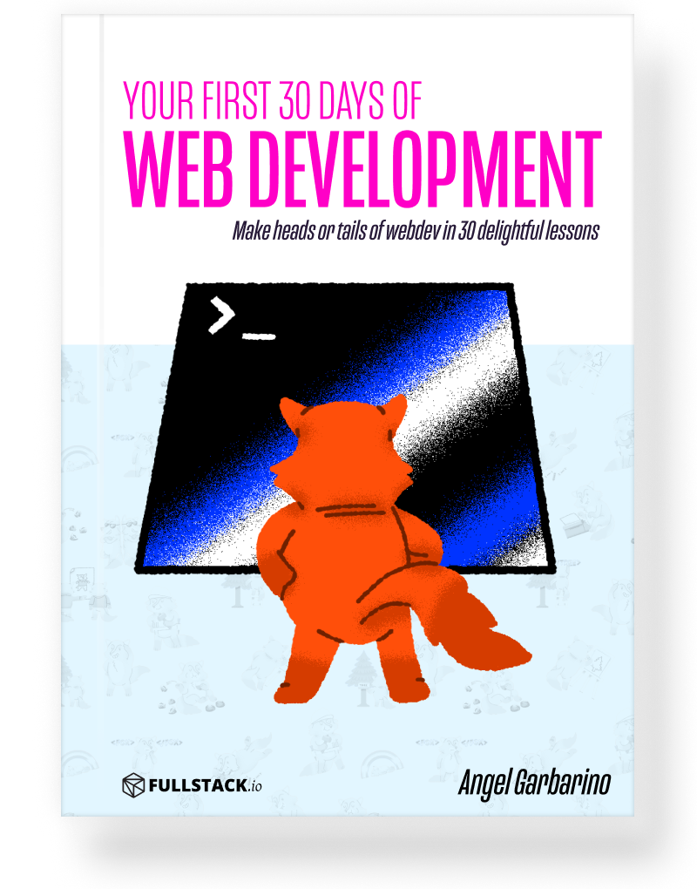
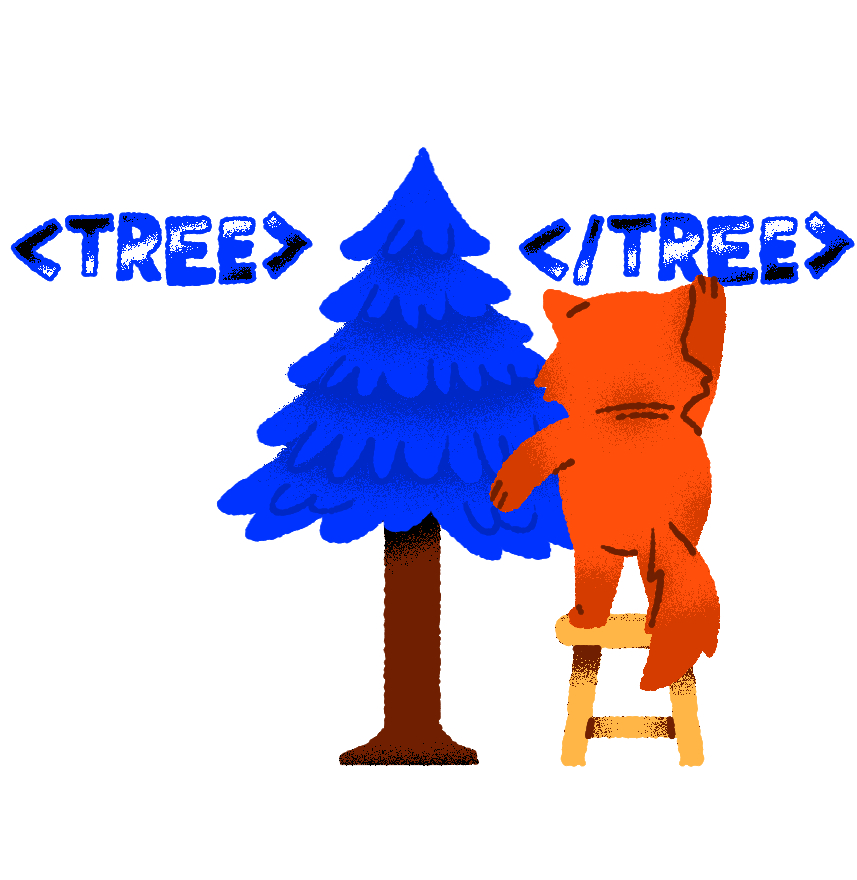
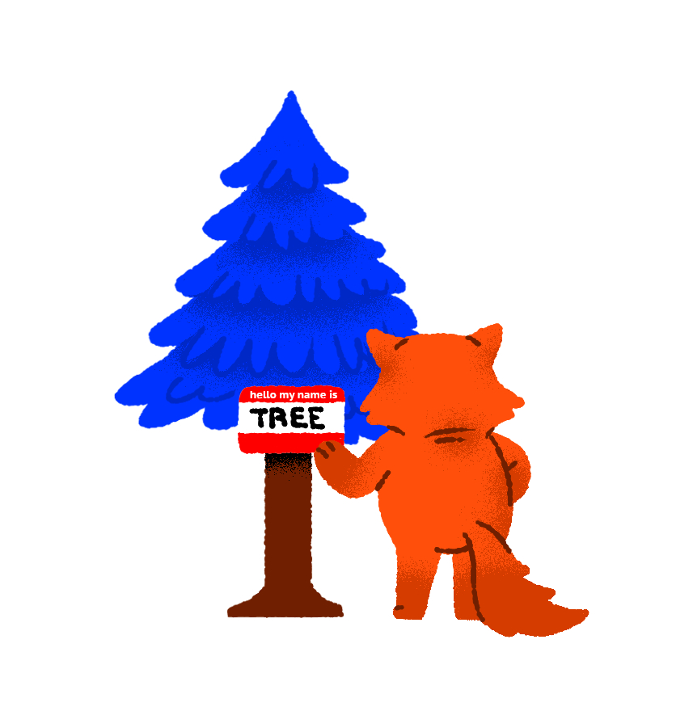
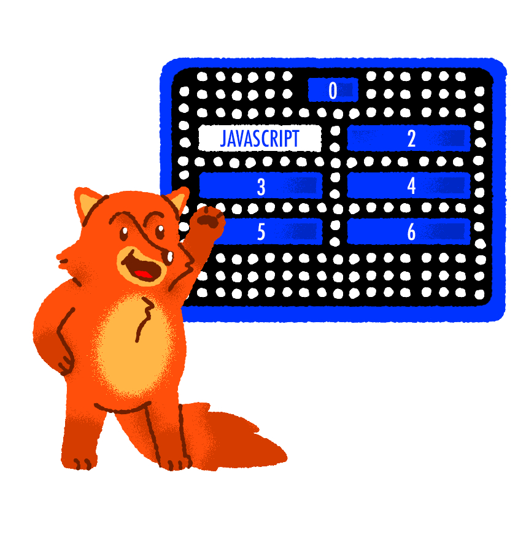
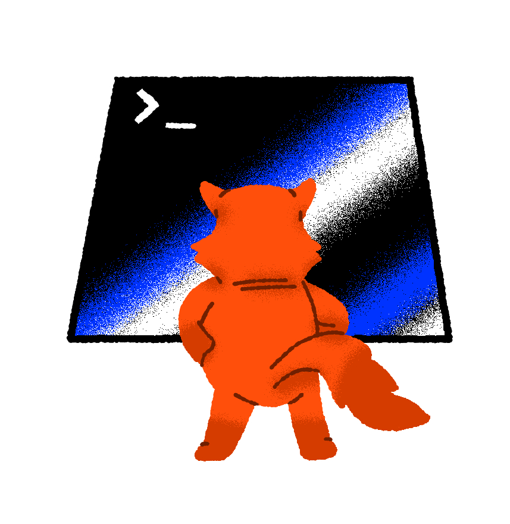
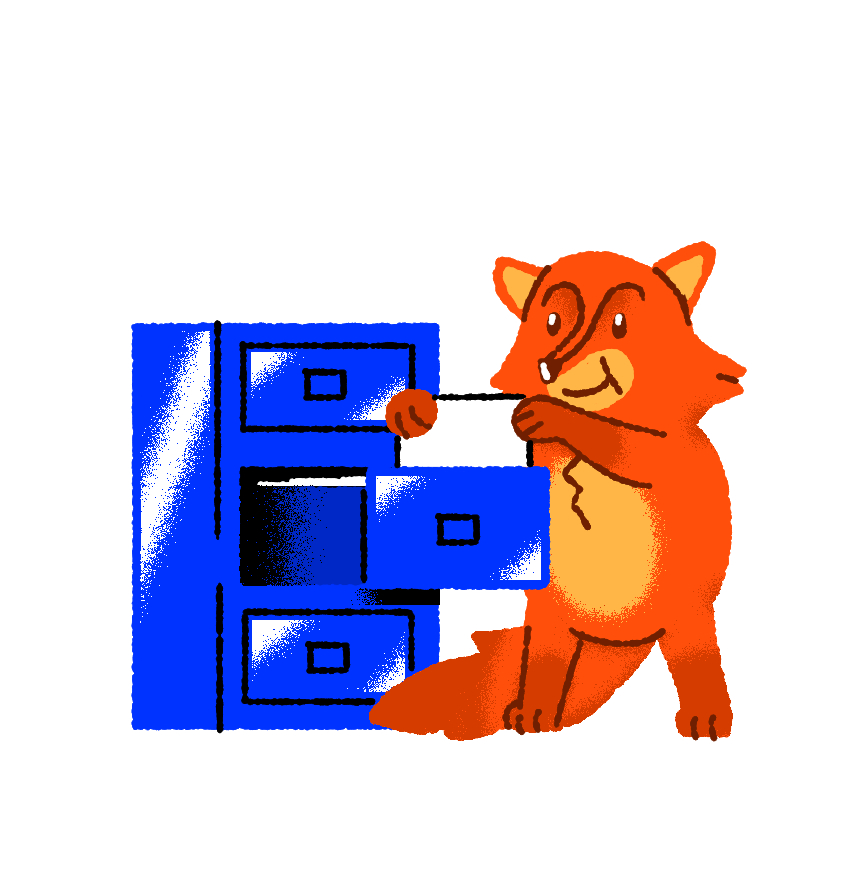

  

<h3 align="center">
  ✨ Your First 30 Days of Web Development ✨
</h3>

  A Free Introduction to Making Heads or Tails of Web Development in 30 Delightful Lessons. Written by the authors of <a href="https://fullstack.io/web-developers-field-guide">How to Become A Web Developer: A Field Guide</a></a>

  

# 🚀 Introduction

Interested in learning Web Development but having trouble getting started?

I wrote this book for the "me" of five years ago: the person who wants to know _how_ to become web developer. My path was convoluted, and inefficient: but yours does not have to be.

Over the next 30 days, I show you how to navigate the sometimes confusing world of web development (_for free_). We'll walk all of the key ideas in web development, starting with the **very basics** and defining terms that are often skipped.

By the end of this book, you will be able to make an educated decision about your future and understand the steps and commitment it will take to get there.

This repository contains the entire source and content for the article series of [30 Days of Web Development](https://fullstack.io/30-days-of-webdev) hosted by the authors of [How to Become a Web Developer: A Field Guide](https://fullstack.io/web-developers-field-guide).

## 👀 What's inside?

<!-- prettier-ignore -->
|  <h4 align='center'><a href='./day-01'>Can I become a Web Developer?</a><h4> | <h4 align='center'><a href='./day-02'>Developer Tools - Setup and Tooling</a><h4> | <h4 align='center'><a href='./day-03'>Operationg Systems</a><h4> | <h4 align='center'><a href='./day-04'>GUI and Shells</a><h4> | <h4 align='center'><a href='./day-05'>Text Editors</a><h4>  |
|:-:|:-:|---|---|---|
|  <h4 align='center'><a href='./day-06'>HTML is a Markup Language</a><h4> | <h4 align='center'><a href='./day-07'>HTML Tags and Elements</a><h4>  | <h4 align='center'><a href='./day-08'>Playing with Elements and Tags</a><h4>  | <h4 align='center'><a href='./day-09'>Giving HTML some style</a><h4>  | <h4 align='center'><a href='./day-10'>CSS and HTML Together</a><h4>  |
|  <h4 align='center'><a href='./day-11'>CSS Syntax</a><h4> | <h4 align='center'><a href='./day-12'>Selector Specificity with CSS</a><h4> | <h4 align='center'><a href='./day-13'>Playing with CSS Selectors</a><h4>  | <h4 align='center'><a href='./day-14'>CSS Units</a><h4>  | <h4 align='center'><a href='./day-15'>Adding Interactivity</a><h4>  |
|  <h4 align='center'><a href='./day-16'>Why is JavaScript Important?</a><h4> | <h4 align='center'><a href='./day-17'>JavaScript in the DevTools</a><h4>  | <h4 align='center'><a href='./day-18'>What is a Programming Language</a><h4>  | <h4 align='center'><a href='./day-19'>Top 10 Programming Languages</a><h4>  | <h4 align='center'><a href='./day-20'>A Closer Look at The Top 4 Programming Languages</a><h4>  |
|  <h4 align='center'><a href='./day-21'>Frameworks and Libraries</a><h4> | <h4 align='center'><a href='./day-22'>Navigating Job Postings</a><h4>  | <h4 align='center'><a href='./day-23'>What is a terminal?</a><h4>  | <h4 align='center'><a href='./day-24'>CLI vs. GUI</a><h4>  | <h4 align='center'><a href='./day-25'>File Paths Part I</a><h4>  |
|  <h4 align='center'><a href='./day-26'>File Paths Part II</a><h4> | <h4 align='center'><a href='./day-27'>File Systems and Types</a><h4> | <h4 align='center'><a href='./day-28'>Introduction to Git</a><h4>  | <h4 align='center'><a href='./day-29'>Introduction to GitHub</a><h4>  | <h4 align='center'><a href='./day-30'>Web Developer Field Guide</a><h4>  |

## 👩‍🏫 How to use this repository

Each day contains a lesson that teaches a concept for getting into web development. Some of the lessons have exercises and example code, which is contained in the `src` folder of each day.

## Contributors

<!-- ALL-CONTRIBUTORS-LIST:START - Do not remove or modify this section -->
<!-- prettier-ignore -->
<table>
  <tr>
    <td align="center"><a href='https://github.com/Monkeychip'><h4 align='center'><a href='https://github.com/Monkeychip'>Angel Garbarino</a></h4></td>
    <td align="center"><a href='https://newline.co'><h4 align='center'><a href='https://newline.co'>Nate Murray</a></h4></td>
  </tr>
</table>

<!-- ALL-CONTRIBUTORS-LIST:END -->

# How to Become A Web Developer: A Field Guide Book

This repo was written and is maintained by the authors of [How to Become a Web Developer: A Field Guide](https://fullstack.io/web-developers-field-guide) team. In the book, we cover in even more depth the next steps to becoming a web developer. We have in-depth exercises on learning HTML and CSS, JavaScript, the Terminal, Git and more.

It's written with the **absolute beginner** in mind.

This series, _30 Days of Web Development_ covers only the early basics of Web Development. If you're considering starting a career as a web developer, but you've been confused as to what to learn first, then go grab a copy of [How to Become a Web Developer: A Field Guide](https://fullstack.io/web-developers-field-guide)
