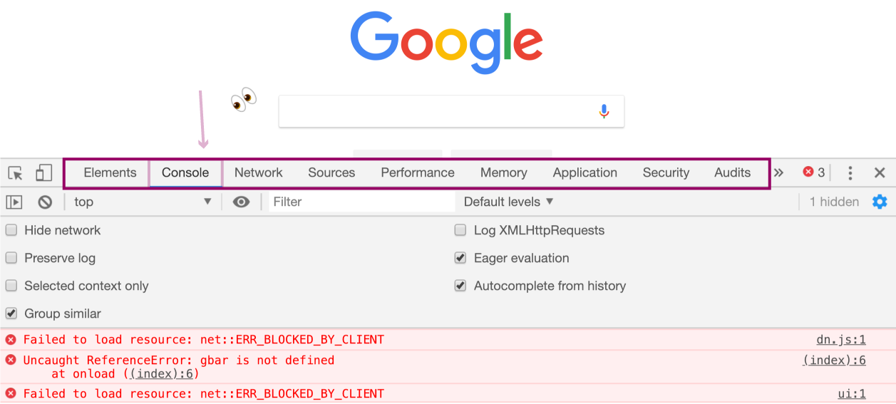
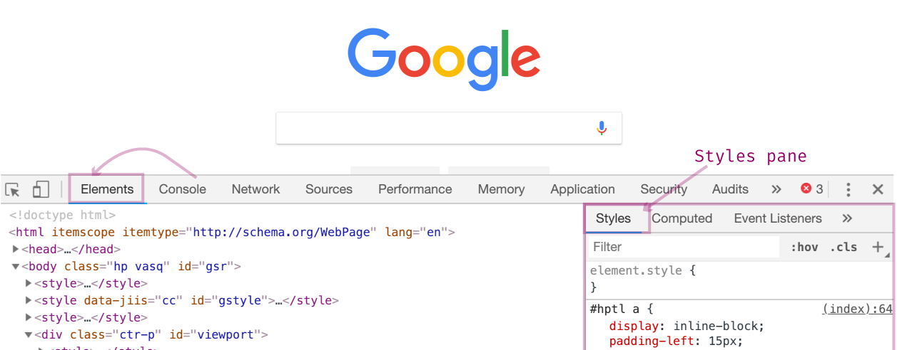
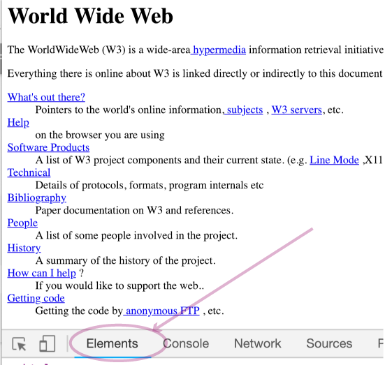
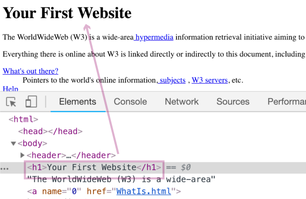

# Day 02 - Developer Tools - Setup & Tooling

Now that we know what Web Development *is* and *why* we want to learn more let's get set up with some essential tooling.

## Developer Tools

Every modern browser comes with web developer tools (also called DevTools). These tools are used heavily by - you guessed it - Web Developers. The DevTools aim to help developers test and debug their code.

A good chunk of our future exercises will require that we use a web browser and DevTools.  We will be using the Chrome web browser, and subsequently, the Chrome DevTools.

#### Exercise: Opening Chrome DevTools

1\. Navigate to any web page using the Chrome web browser.

There are several ways to open the DevTools, but I recommend using the keyboard shortcut method because it's the quickest and most convenient.    

With a web page open, hold `command + alt + j`.  Windows Users, use `ctrl + shift + j`.

Once you have the DevTools open, you should see the following window pop-up. Depending on your settings, the DevTools may show up at the bottom of the screen or on the right-hand side.

A couple of things to note:

* By default, you will land on the **Console** panel.  The Console is a panel in the DevTools where Chrome executes commands that you type there.

* Everything inside the dark pink box is called a **panel**.  To the left of the Console panel, for example, is the **Elements** panel.

* The red errors I show on my Console panel may or may not show for you.  Errors like this are for Web Developers and are sent to the Console panel from the web page you are on.  For our purposes, we can ignore them.

2\. Let's navigate over to the Elements panel. Click on the Elements panel (just to the left of the Console panel).

The Elements panel shows the web page as "code."  A good way to visualize what the Elements panel does is to think of the web page as a stitching.  The Elements panel would then be the backside of the stitches; they're the same, one is just prettier.
{#stitching}

3\. To help demonstrate how the DevTools can be useful, we are going to change the text of something on a web page.  For this example, we are going to use the very first website ever created.  Built-in 1991 by CERN, it’s rather incredible that this first website is still visible and usable today.

Open the first website in your Chrome browser by clicking on the [link here](http://info.cern.ch/hypertext/WWW/TheProject.html).

4\. Open the DevTools and navigate to the Elements panel.

Under the Element’s section is the HTML of the web page.  We will be playing with the heading Element.

Click on the `<h1></h1>` element.  This is the element that makes the header of the web page read "**World Wide Web**".

I>We talk more about **HTML**, **elements** and **tags** in an upcoming article. For now, it's enough to know they represent the structure of the web page.

5\. Next, double-click on the `World Wide Web` text, and change the text from "World Wide Web" to "Your First Website."  To see the change take effect, click outside of the Elements panel.

Now look at the web page and see that the text inside the `<h1></h1>` element has changed.

It's worth stopping for a moment to appreciate what you just did: you modified a web page!  Nicely done.

### Summary

A browser's developer tools do way more than allow you to make text changes.  You can modify colors, layout, run code, and see details of how the web page is loading.  Learning how to navigate and use the DevTools will be an essential skill that you will pick up on your way to becoming a Web Developer.

### What's next?

Tomorrow we'll learn more about Operating Systems, and why understanding some of their key concepts will help you understand the foundations of Web Development.

