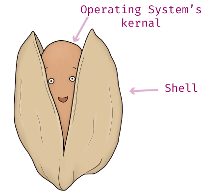

---
coverImageBackgroundPosition: "50% 87%;"
---

# Day 03 - Operating System - Setup & Tooling

Most folks know that "Operating System" means something with a computer, and _maybe_ involves Steve Jobs, Bill Gates, or was it was Mark Zuckerberg...  

This inaccurate and shallow understanding of an Operating System is satisfactory for everyday use.  However, it's not sufficient for those who want to work in web development.

First off, ignore Mark Zuckerberg - words of wisdom that are applicable outside of our discussion on Operating Systems.  And Steve Jobs and Bill Gates are only relevant because they are figureheads for Apple and Windows, which respectfully sell computers with the macOS and Windows OS on them.

## What do Operating Systems do?

A lot.  Generally speaking, they manage the hardware of your computer. Your computer's Operating System is in charge of:

* **File Management**. Anytime you make a file, folder, delete, or move things on your computer. Those actions are controlled by your Operating System.

* **Managing Process**.  All the applications you currently have running on your computer, email, internet, solitaire, etc. are all controlled by your computer's Operating System.

* **Managing Memory**. Your computer's memory primarily comes from RAM (rapid-access memory).  All process, applications, actions on a computer requires some amount of memory. It's common for computers to come shipped with anywhere from 4-16+ gigabytes of RAM.

* **Managing Storage**.  Memory and storage are different. The amount of RAM you have says nothing about the amount of storage your computer has. Storage is associated directly with your computer's hard disk drive or solid state drive.  Storage is where data stays until forcefully removed.  Things remain in storage even when your computer is off.

T>When you save a word doc, that goes into storage.  When you open the word application, like Google Docs that requires RAM.

#### Storage vs. RAM

In the following screenshot, you can see I have 16 gigabytes of memory, and 698.23 gigabytes of storage available.  I located these metrics on my Mac by clicking on the Apple 🍏 icon and navigating to "About This Mac."

This all makes sense if you remember **your Operating System controls your computer's hardware**.  Your computer only listens to binary code (0s and 1s).  Via fancy translation, your Operating System listens to what you tell it- like "make a new file" - and it translates this command into something your computer can understand.  The result is your computer allocating memory and storage to "make a new file."

## Different Types of Operating Systems

There are 3 common Operating Systems for Desktop Computers: macOS, Windows OS, and Linux.

If you are on an Apple Computer, then you have a macOS, if you’re on a Windows machine, then you’re using a Windows OS, and if you’re on a Linux, you already know it.

It does not matter what kind of Operating System you are using. You can program with the best of them.  What system you have will likely depend on what company you work for.  For all our future examples, the screenshots are taken from a macOS. Again, having or not having a macOS bears no weight on your ability to complete the exercises.

T>All Macs, Windows, and Linuxes are Personal Computers (PCs).  You can, in fact, install a Windows OS onto a Mac PC, or install macOS onto a Windows PC.  In the end, they're all just PCs with a program (operating system) that lets you control it.

All the other differences: specifics about file system encryption, or third-party hardware compatibility are topics outside the scope of our concern.  The only real difference we're concerned with is the General User Interface; **GUI** for short, pronounced “gooey”.

### GUI's

Though you may not know it, you’re very familiar with GUI’s. These are programs designed to make it easy for the everyday computer user to do things with their computer. They use graphics, icons, and menus to make navigation and executing commands easy.

An example of a popular GUI is the Finder program, see the following screenshot.  The equivalent program in Windows is “Finder Explorer.”

MacOS and Windows OS have slightly different ways of organizing and presenting files. Functionally, these differences will not matter to us. However, if you find any of the examples difficult because you are using a different operating system, please reach out to us for assistance.

## Shell and the Kernel

Shell and Kernels are about as deep as we need our learning of Operating Systems to go for now.  However, understanding even on a surface level, these two terms will clarify _how_ you can work with an Operating System; something you'll be doing as a web developer.

A **Shell** is an interface that gives you access to your computer’s Operating System. Think of it as a wrapper around your Operating System - technically it wraps around your Operating System’s Kernel. Hence the name Shell - a shell/protective barrier - around the brain/core of your computer.

The **Kernel** is a computer program, that is the core of your computer's Operating System.  For our purposes, it's enough to know that it connects all your computers application software to the hardware of your computer.  Most like to think the Kernel is the Operating System.  This is not accurate, however, as it's only a part of the Operating System, not the whole thing.

### GUI's are a type of Shell

Remember a moment ago when I said that your Finder program was a GUI?  Well a GUI is also a type of Shell.  It makes sense if you think about it.  You use your Finder to do things to your Operating System's file system, like make or delete folders and files.

## Why Again do I need to know this?

You don't need to be an Operating System expert to be a Web Developer.  You should, however, as a developer, understand some of the fundamentals.  

Code doesn't just run on its own.  When you write programs or applications for other people to use, they will be using computers.  And guess what those computers will be using to run your programs or application?  An operating system.

What if you write an amazing web application, but it zaps all of your users' RAM? Your users probably won't be that happy.  If you've ever had the pleasure of using Microsoft Excel you'll know that once you make anything slightly North of complicated on that program, your computer comes to a screeching halt, because it has taken all your computer's RAM trying to run. 

In our next installment of the series, we'll finish up our Setup & Tooling by installing our text editor.
