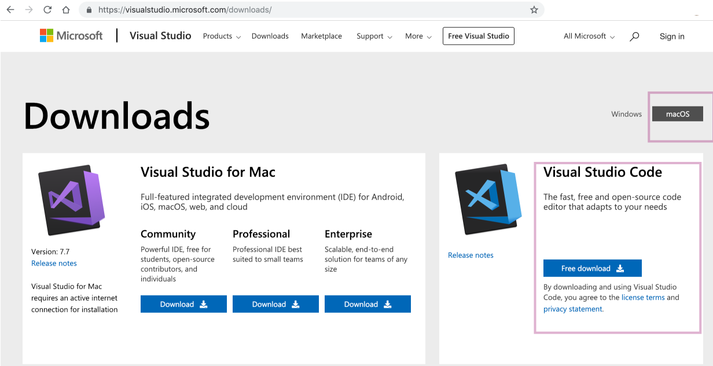
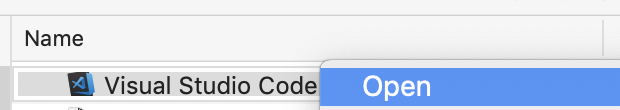
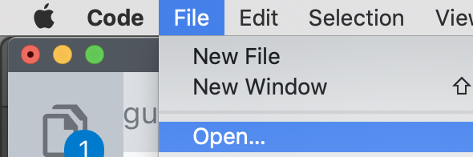
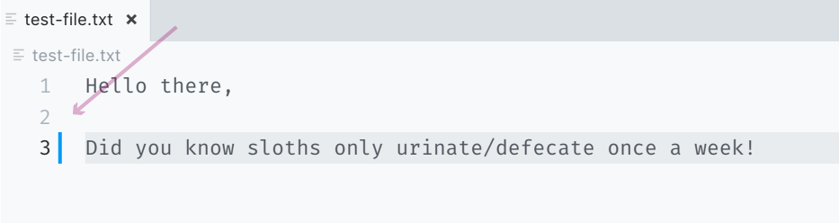
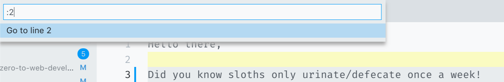

# Day 04 - Text Editor - Setup & Tooling

Every mainstream computer comes with what is called a **text editor**.  What this means is that this program edits text without adding markup, i.e. in plain text.  Developers use text editors to assist in writing "code".

I>A **text editor** is not the same as a **word processor**.  A word processor, something like Microsoft Word or Open Office, adds styling to text (e.g., margins, font-size, bold, italic, etc.).  A text editor does not. When you write code, it's crucial that you *do not* use a word processor because the added styling will corrupt your code.

Technically, you could use your computer's default text editor to write code.  However, because developers use their text editors so much, it shouldn't surprise you to learn they have developed fancy, sophisticated text editors for the sole purpose of writing code.

For these exercises, I am going to suggest you use the **VSCode** text editor.  For several reasons: it's free, easy to navigate for beginners, and is a great first text editor that you can continue to use as you advance in web development.

W>I refuse to be brought into a debate about which text editor is better than another.  By suggesting folks start off with VSCode I am not making a statement that it is better than say Sublime or Atom. In fact, either of those would also be fine substitutes.  I'll leave the text editor debates to those also debating Windows vs. Mac.

#### Exercise: Setting up VSCode

In this Exercise, we are going to download/install VSCode, and practice opening and navigating around a text file.

1\. Download VSCode [here](https://visualstudio.microsoft.com/downloads/).

You'll want to select the Free version which you can find under "Visual Studio Code".  See the pink box in the screenshot.  Also, make sure you are downloading the correct version.  If you are on Windows you will need to select "Windows", and not "macOS", like I have here.

2\. Once you click download, a zip file will start downloading.  Open it when it's done.  Once downloaded move the VSCode application to your Applications folder.

3\. Open VSCode like you would any other Application.

4\. First things first, let's make this thing look good.  The default theme in VSCode is pretty good, but I want to show you where you can modify these settings in case you have different preferences.

Open VSCode preferences by clicking Code -> Preferences -> Settings.

Once you're in Preferences, search for "theme" in the search navigation (see the top-most pink box in the following screenshot).

After searching for "theme" an area will come up where you can select a different theme.

Out of the box, VSCode comes with a variety of themes.  I am using a theme called "Verdandi" because it's light and easy to take screenshots from (Verdandi is not included by default. I had to download it).  For now, just play around with different themes and see which one you like best.

I>If you want to explore even more themes, you can find them in the [VSCode Marketplace](https://marketplace.visualstudio.com/search?term=themes&target=VS&category=Tools&vsVersion=&subCategory=All&sortBy=Relevance).

5\. Now that we have our vanity taken care of, let's open a simple text file using VSCode.

Download the following [`test-file.txt`](public/src/1-setup/test-file.txt).

Now, back in VSCode, open the file you just downloaded by clicking File -> Open, and select the file `test-file.txt`.

6\. Once open, you should see something like the following screenshot - remember your theme/look is likely different than mine.  

7\. One very helpful thing about text editors like VSCode is that they give line/row numbers.  We will use these in our examples to describe where on the document you should look.  So for example, if I say "on row 3", I mean the row with the sloth fact.

Use the keyboard shortcut `control + g` to navigate to a specific row. Once you hit that command you'll be asked to type in a line number.  Here I typed in 2, and you can see the line 2 in highlighted is light-yellow.

You don't have to use this command, but it's helpful if you have a big file and want to navigate to a specific line/row number quickly. Try it out and see if you find it helpful.

8\. One last "how to" that we should know for VSCode is saving.  Saving here is just like saving in any other application.  You can go to File -> Save, or as I prefer, use a keyboard shortcut `command + s` (control for Windows users).

By the end of these 30 days, you'll have more practice using VSCode and should get more comfortable using it. VSCode has a lot more bells and whistles, and if you'd like to learn more about them, I recommend VSCode's ["Getting Started" videos](https://code.visualstudio.com/docs/introvideos/basics).

That's it for Setup & Tooling.  Tomorrow, we'll start looking at the foundational language of the web, HTML. 