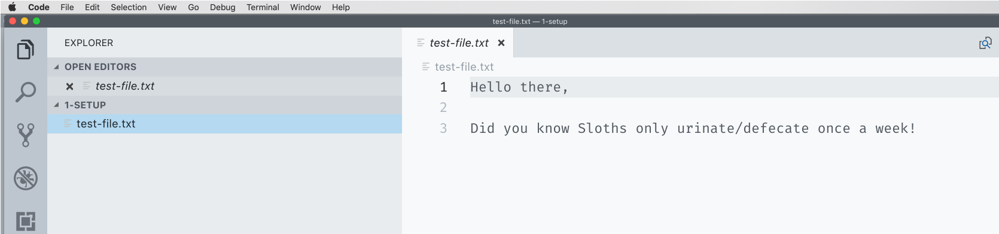

# Text Editor - Setup & Tooling

> Today, you will meet your soon to be best friend: the text editor. A text editor is a fancy tool that developers use to write code.

Your computer comes with what is called a **text editor**. A text editor is a program that edits text without adding "markup" like **bold** and _italic_. This is also known as _plain text_. Developers use text editors to assist in writing "code", which is plain text that describes a program.

I>A **text editor** is not the same as a **word processor**. A word processor, something like Microsoft Word or Open Office, adds styling to text (e.g., margins, font-size, bold, italic, etc.). A text editor does not. When you write code, it's crucial that you _do not_ use a word processor because the added styling will "corrupt" your code (it just won't work).

Technically, you could use your computer's default text editor to write code. However, because developers use their text editors so much, it shouldn't surprise you that they have developed fancy, sophisticated text editors for the sole purpose of writing code.

For this blog series, I am going to suggest you use the **VSCode** text editor. For several reasons: it's free, easy to navigate for beginners, and is a great first text editor that you can continue to use as you advance in Web Development.

W>I refuse to debate which text editor is better than another. By suggesting folks start with VSCode, I am not making a statement that it is better than say Sublime or Atom. In fact, either of those would also be fine substitutes. I'll leave the text editor debates to those also debating Windows vs. Mac, or that toilet paper roll [over vs. under thing](https://www.reviewed.com/home-outdoors/features/the-over-under-toilet-paper-debate).

#### Exercise: Setting up VSCode

1\. For our first step, we need to download VSCode. You can do that [here](https://visualstudio.microsoft.com/downloads/).

You'll want to select the Free version which you can find under "Visual Studio Code." See the pink box in the screenshot above. Also, make sure you are downloading the correct version. If you are on Windows, you will need to select "Windows," and not "macOS," as I have here.

2\. Once you click download, a zip file will start downloading. Open it when it's done. Once downloaded, move the VSCode application to your Applications folder.

3\. Open VSCode like you would any other Application.

4\. Next, let's open a simple text file using VSCode.

Download the following [`test-file.txt`](public/src/1-setup/test-file.txt).

Back in VSCode, open the file you just downloaded by clicking File -> Open, and select the file `test-file.txt`.

5\. Once open, you should see something like the following screenshot (your theme/look is likely different than mine).

6\. One helpful thing about text editors like VSCode is that they give line/row numbers. We will use these in our examples to describe where on the document you should look. For example, if I say "on row 3", I mean the row with the sloth fact.

Use the keyboard shortcut `control + g` to navigate to a specific row. Once you hit that command, you'll be asked to type in a line number. Here I typed in 2, and you can see the line 2 is highlighted light-yellow.

You don't have to use this command, but it's helpful if you have a big file and want to navigate to a specific line/row number quickly. Try it out and see if you find it useful.

7\. One last, "how to" that we should know for VSCode is saving. Saving here is just like saving in any other application. You can go to File -> Save, or as I prefer, use a keyboard shortcut `command + s` (control for Windows users).

By the end of these 30 days, you'll have more practice using VSCode and therefore get more comfortable using it. VSCode has a lot of bells and whistles, and if you'd like to learn more about them, I recommend VSCode's ["Getting Started" videos](https://code.visualstudio.com/docs/introvideos/basics).

### What's next?

That's it for Setup & Tooling. Tomorrow, we'll start looking at the foundational language of the web, HTML.
