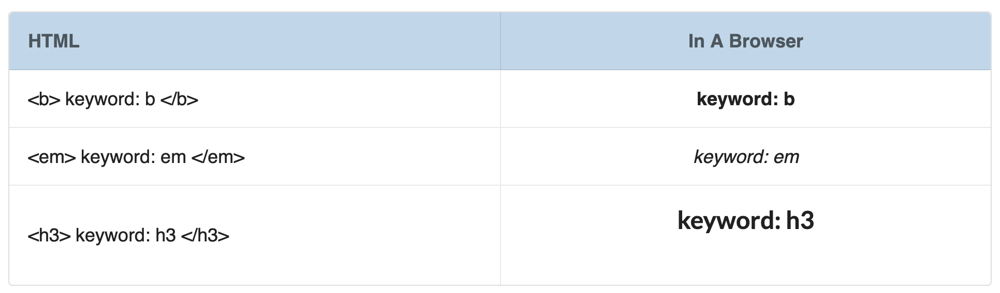
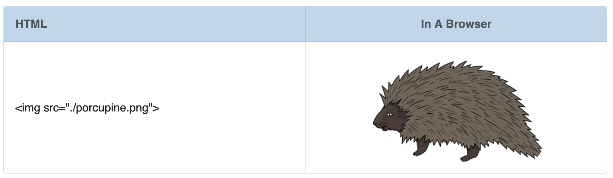
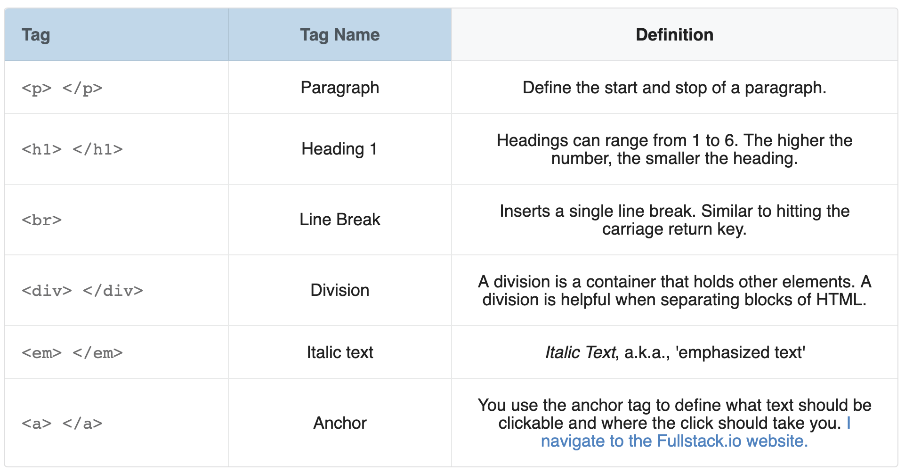
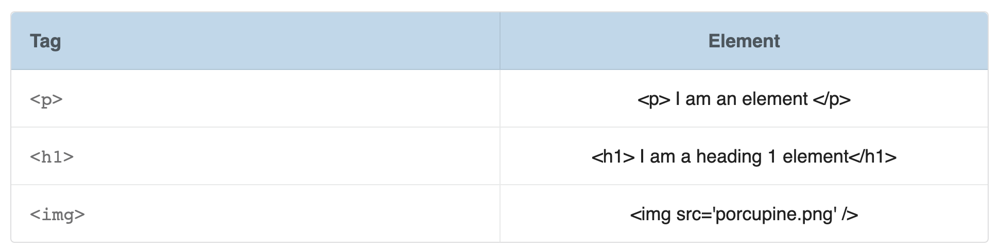

# HTML Tags and Elements: Definitions, Examples, and Relationships

> Elements are made up of tags, tags are not made up of elements. Elements are the building blocks 🏗 of HTML.

Yesterday we learned that HTML is a kind of Markup Language. HTML, however, is not the only type of Markup Language. This blog post, for example, is written in [Markdown](https://daringfireball.net/projects/markdown/), another type of Markup Language.

T>I hate when words like this are used in the same paragraph, Markdown 👇 vs. Markup 👆. Markdown - with the _down_ at the end, is a specific type of Markup Language - with the _up_ at the end. The particulars of the format aren't important, just know that there are _multiple_ kinds of Markup Languages (not just HTML).

If I wanted to write a **bold word** in this blog post, using the Markdown Language, I start and end the word with double asterisks. Like this: `**bold word**`. In HTML, I would write **bold word** like this: `<b>bold word</b>`.

Each Markup language uses its own rules to define blocks of text and assign formatting. HTML does this by using **tags** and **elements**.

#### HTML Tags

HTML **tags** are special keywords surrounded by a pair of angle brackets `<tag keyword>`. Most tags come in pairs, with an opening and closing tag. The closing tag is the same as an opening tag with the addition of a forward-slash. The closing bold tag looks like this `</b>`.

Some tags, like the tag used to display an image ``, do not have a closing version. This is because you do not need to define an opening and closing to display an image, just a location of where the image can be found.

There are close to 100 HTML tags [^html-tags]. Below are some of the more common ones. If they have a closing tag, I've included it.

#### HTML Elements

HTML **elements** are individual components of HTML defined by HTML tags. At first glance, elements and tags can easily be mistaken for the same thing. But they are not. The key thing to remember is that **elements are made up of tags, but tags are not made up of elements**.

To help clarify, see the following examples of tags vs. elements.

Where tags are used to define the start and stop of an element, elements refer to _both_ the opening and closing tag and everything in-between. The elements that don't require a closing tag, like the `` element, are called **void elements**. Elements are the building blocks of a web page and are a concept that we will continue to revisit.

T> **Elements vs. Tag**
T> Elements are made up of tags, tags are not made up of elements. Elements are the building blocks of HTML. Example of an element: `
Paragraph Element
`, example of a tag `
`

### What's next?

Today was all reading and no doing. Tomorrow, we'll change that and get our start playing with tags and elements using VSCode.

[^html-tags]: In total, there are around 100 different Markup Tags available. A list of them can be found [here](https://www.w3schools.com/tags/ref_byfunc.asp).
