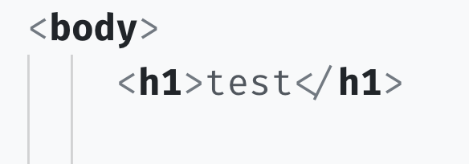

# Day 07 - Playing with Elements and Tags - HTML

We should know be comfortable understanding the basic syntax of HTML. Today we'll start using what we learned yesterday to change the look of a web page.

#### Exercise: Uncomment HTML

1\. Download and open in VSCode the following html document [`html-practice.html`](public/src/html-practice.html).

2\. In your text editor, you'll notice that a lot of the HTML is greyed-out  (my theme colors the commentgrey, but depending on your theme it maybe a different color).  That is because the majority of the HTML is commented out.

The "Uncomment #1" indicates the HTML snippet I want to uncomment here for practice.

I>Comments wrap around the text you want to comment out, with an opening set of characters and closing set of characters.  To comment around HTML, you use a less than character <, plus an open exclamation point ! followed by two dashes --.  This opens the comment.  To close the comment, you use two dashes -- followed by a greater than character >.  Here’s an example: `<!-- to my left is open, to my right is close -->`.  The text in-between the opening and closing set of characters is what is commented out.

Comments are helpful because they allow us to write out HTML without it being displayed in the browser.  When we're ready to display the HTML snippet, we remove the comments wrapping the snippet.

To delete a comment (a.k.a "uncomment"), you need to remove the opening `<!--` and closing `-->`.  So for example, the first comment we will uncomment is #1. 

Here's what it looks like after uncommenting #1.

3\. Next, make sure you save your changes, and then review them in the browser.  On your computer, go to where the "html-practice.html" file lives.  Right click on it and open it with Chrome.

4\.  Once opened in the browser, assuming you have uncommented #1, you should see something like the following screenshot:  

5\. Let's test out the HTML elements we introduced in yesterdays article. In VSCode go ahead and uncomment snippets #2, #3, #4, and #5. These four snippets show the bold `b`, italic `em`, heading-3 `h3`, and `img` tags.

Notice there is no closing tag on the `` element. Everything you need to display the image is contained within the opening `<` and closing angle brackets `>`.

Hopefully, by uncommenting the HTML you can see how the various HTML tags work and effect what you see on the browser.

6\. For our last step, let's modify the #4 tag, the `h3` tag.  Let's change it to a paragraph tag and change the text.

Feel free to change to the text to whatever you'd like, but in my example, I changed it to "meeping".

Keep playing around if you'd like.  To experiment with more HTML tags, checkout W3Schools list [here](https://www.w3schools.com/tags/).

Tomorrow we'll spice 🌶 things up by using the DevTools to play with a Web Pages Tags and Elements.