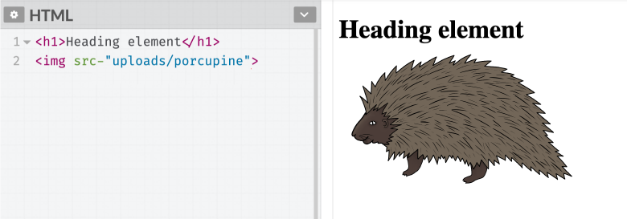
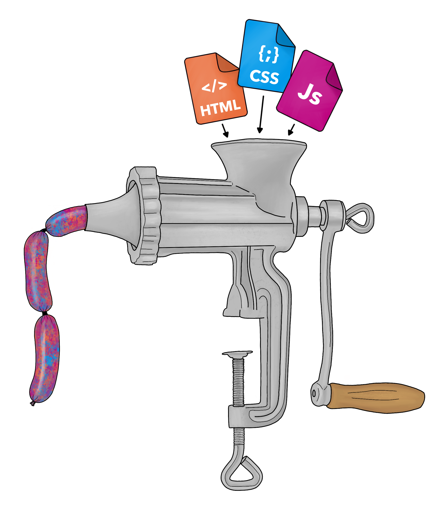

# Day 08 - How the browser "reads and writes" HTML

I think we can agree that HTML does not look like a web page.  In the following screenshot, what we see on the left (HTML) is not what we see on the right (web page).

So how does the browser take HTML elements like the following `<h1></h1>` and `` and turn them into more appealing text and a porcupine image?

The browser does this through a process called **rendering**.  The terms render (also referred to as "process") is used throughout programming, and in general, it merely means to display.

I am going to treat the rendering process like it is a recipe for making sausages.  I want to give you just enough to get a general understanding, but I don't want to scare you off with too many details.

### Rendering Engine

When a browser retrieves an HTML file, it uses its **rendering engine** to read the file from top to bottom.  While reading the HTML file, the rendering engine **parses** the HTML.  Parsing, put simply, is the browser working through the markup.  

During the parsing process, the browser is checking for proper nesting structure, and loading any external resources the HTML file tells it to use.  

In most web pages the HTML document will include several `<script>` and  `<link>` tags.  These tags include links to external files[^external] and indicate to the rendering engine that to display the web page, it will need to get these files and apply their instructions as well. We will cover some of these external file types in greater detail in the following chapters. 

I>When investigating the first web page, we didn't encounter any of these external files because the first web page didn't require any additional styling, images, or functionality. However, we do run into these file types in the next chapter, so for now, take note.

Once the rendering engine is done parsing the HTML, it turns what it read into a model called the **DOM Tree**.

### DOM 
{#DOM}

The Document Object Model, a.k.a. DOM (pronounced: Dom as in *Dom*inique), is the browser's completed model of what the HTML will look like.  It's referred to as the DOM Tree because it looks like a tree diagram.  Each HTML element is represented as a **node** on the diagram. 

W> The DOM is an important concept.  Get a general understanding of it now, and more difficult programming concepts will make sense faster later on.  It's not the most intuitive concept, so take your time, and try and wrap your head around it.

I find that words are not enough to quite explain what a DOM tree is; it is best visualized.  In the following diagram, hopefully, the connection between the HTML elements -> DOM -> web page comes through.

The `<body></body>` element is the trunk and coming off the trunk are the `

` and `<h1></h1>` elements.  They are illustrated this way to demonstrate that each element is a _node_ .  And the `

` and `<h1></h1>` elements branch *off* of the `<body></body>` element.

The tree should help illustrate the elements' relationship to one another.

In the previous screenshot, I have illustrated 3 elements as DOM nodes.  The `<body></body>` element is the main "tree" because it wraps the other elements.  In other words, the `<h1></h1>` and `

` elements are nested inside of the `<body></body>` element.   Thus, these elements becomes branches off of the main `<body></body>` element.

Of course, the real DOM Tree doesn't look like something out of Dr. Seuss' Lorax, but the idea is the DOM Tree is a model of the HTML elements' relationship to each other. 

The DOM Tree is a crucial concept because it's the DOM tree that you modify and play with.  The DOM is an abstraction of the HTML.

// ARG: tmrw we'll
