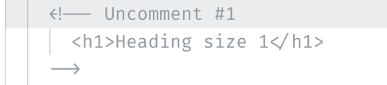
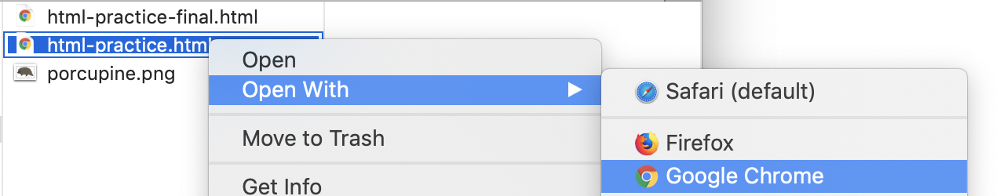
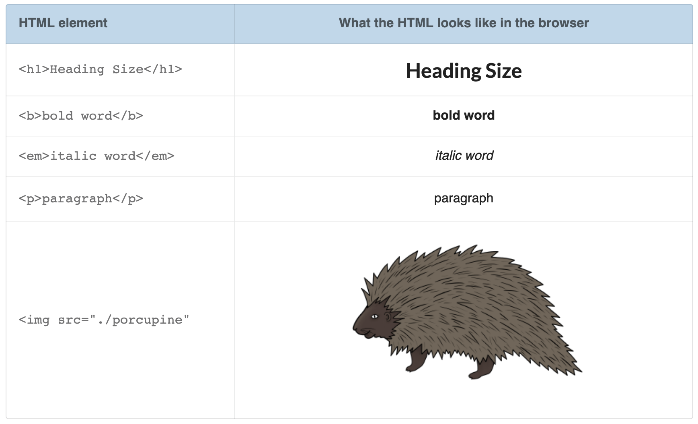
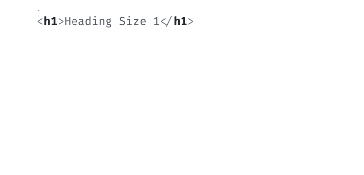
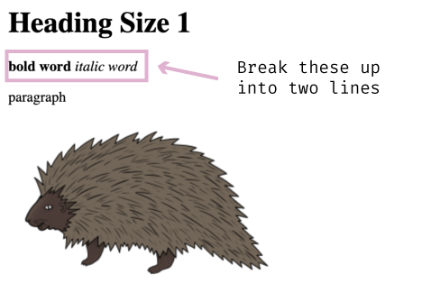
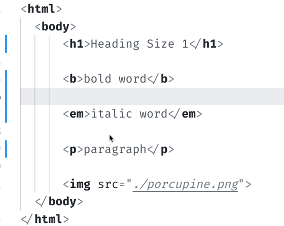
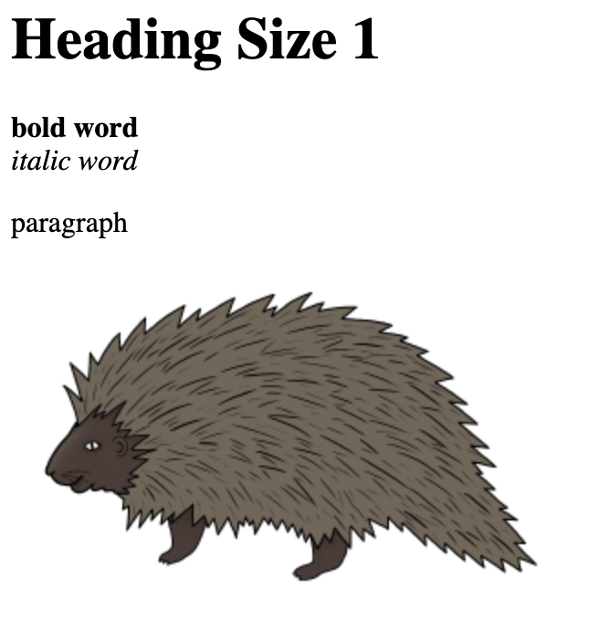

# Playing with Elements and Tags

> Time to get our hands dirty. Let's write some HTML.

We should now be comfortable with the basic syntax of HTML. Today we'll start using what we learned yesterday to change the look of a web page.

#### Exercise: Playing with HTML

In this exercise, we will be "uncommenting" out HTML. A comment is effectively a way to hide HTML. What I mean by "hide" will become clear as we work through this exercise.

To use comments, you wrap the HTML with an opening and closing comment tag. To open/start an HTML comment you use the less than character <, plus an open exclamation point ! followed by two dashes --. To close/end the comment, you use two dashes -- followed by a greater than character >. Here’s an example:

```HTML
<!-- to my left is open, to my right is close -->
```

The text in-between the opening and closing set of characters is what is commented out.

1\. In your text editor download and then open the following HTML document [`html-practice.html`](https://github.com/fullstackio/30-days-of-web-development/blob/master/day-08/src/html-practice.html).

2\. Because of the theme I am using with VSCode, my comments in the following screenshot show as <span style="color: grey">greyed-out</span>. Depending on your text editor's theme, a similar style will be applied to your commented out HTML. Regardless of what color the theme applies, your text editor is trying to show you that this HTML is not displaying.

The "Uncomment #1" indicates the HTML snippet I want to uncomment here for practice.


Comments are helpful because they allow us to write out HTML without it being displayed in the browser. When we're ready to reveal the HTML snippet, we remove the comments wrapping the snippet.

To delete a comment (a.k.a "uncomment"), you need to remove the opening `<!--` and closing `-->`.

Let's uncomment snippet #1.



3\. Next, save your changes in VSCode.

Next, on your computer, go to where the "html-practice.html" file lives. Right-click on the file and open it with Chrome.



4\. Once opened in Chrome, assuming you have uncommented #1, you should see something like the following screenshot:


Nice work! 👏

5\. Now that we're familiar with how to uncomment an HTML snippet let's uncomment the other snippets. These other snippets are each examples of the HTML elements we introduced in yesterday's article.

In your text editor, go ahead and uncomment snippets #2, #3, #4, and #5. In order, the snippets show examples of:



As a reminder, you use HTML tags to wrap what it is you want to apply that HTML tag to.



Hopefully, by uncommenting the HTML, you can see how the various HTML tags work and affect what you see on the browser.

6\. For our last step, let's make it so the **bold word** and _italic word_ are on two separate lines.



To break up these lines in HTML, we are going to use the HTML line break element `<br>`. This element is effectively a carriage-return, adding a line break where you insert it.

Back in your text editor, add the `<br>` element in-between the `<b></b>` element and the `<em></em>` element.



Save your changes, and then refresh the browser to see the changes take effect.



That looks a little better. And hopefully, you're starting to see how HTML uses tags and elements to structure a web page.

Keep playing around with different HTML elements and tags. I recommend checking out W3Schools list of HTML tags and elements [here](https://www.w3schools.com/tags/). There's a lot we didn't cover, so have at it!

T>I cover crucial HTML topics in 📗 "How to Become a Web Developer: A Field Guide," including such subjects as attributes, nesting, child/parent relationships, indentations, rending and the Document Object Model.

### What's next?

Tomorrow I will introduce CSS - another markup language - that adds style to HTML. We _are_ moving away from HTML but do not take that to mean there is nothing more regarding HTML you need to learn. We skipped **a lot**.
