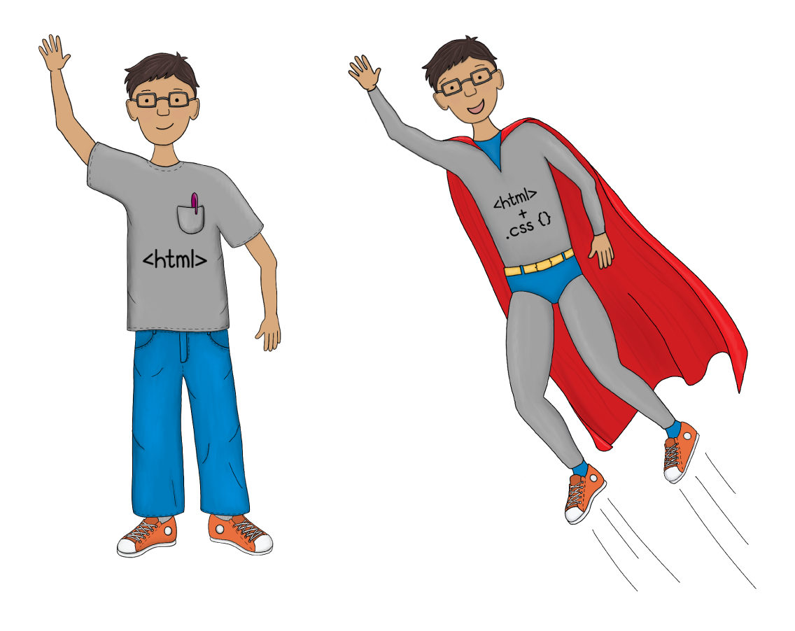
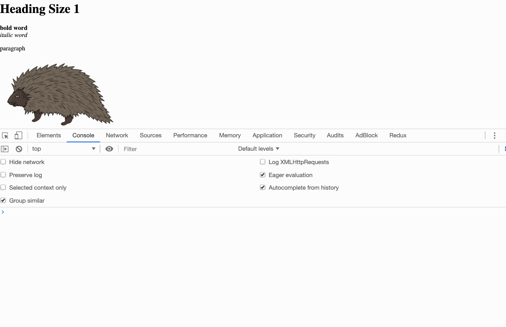
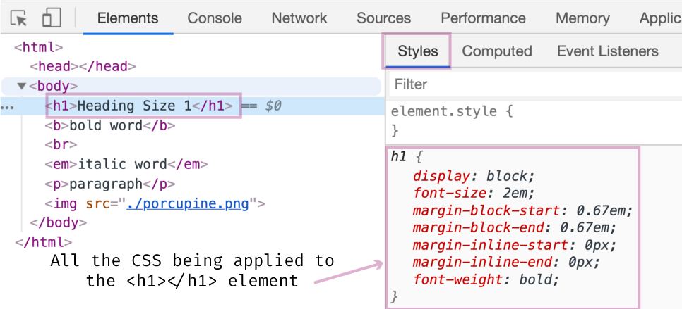
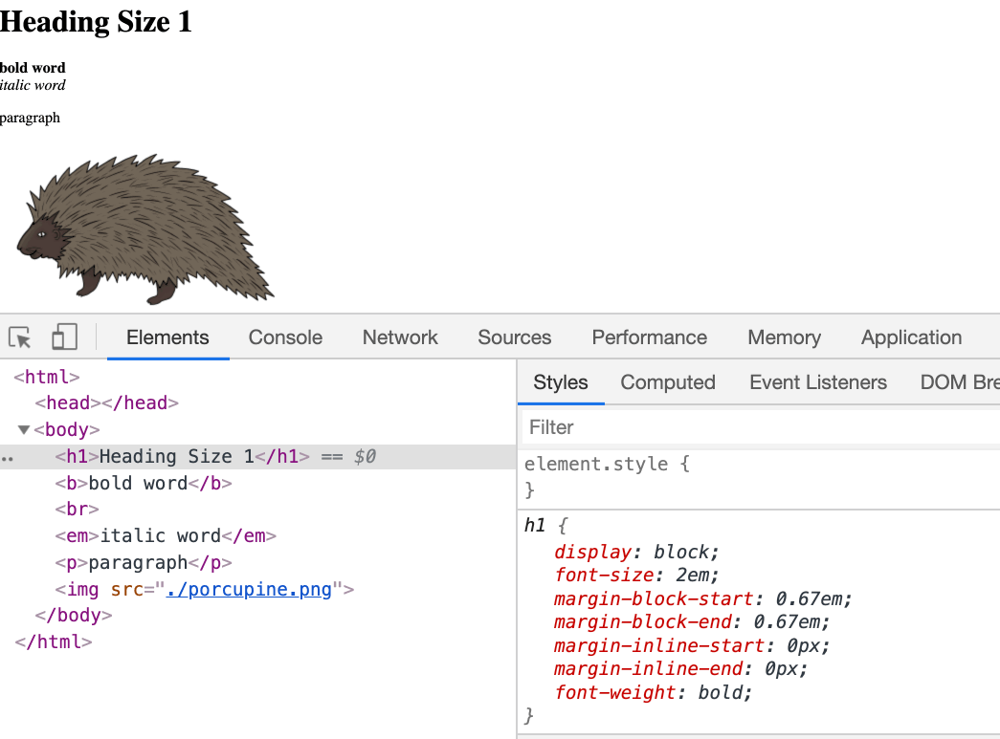
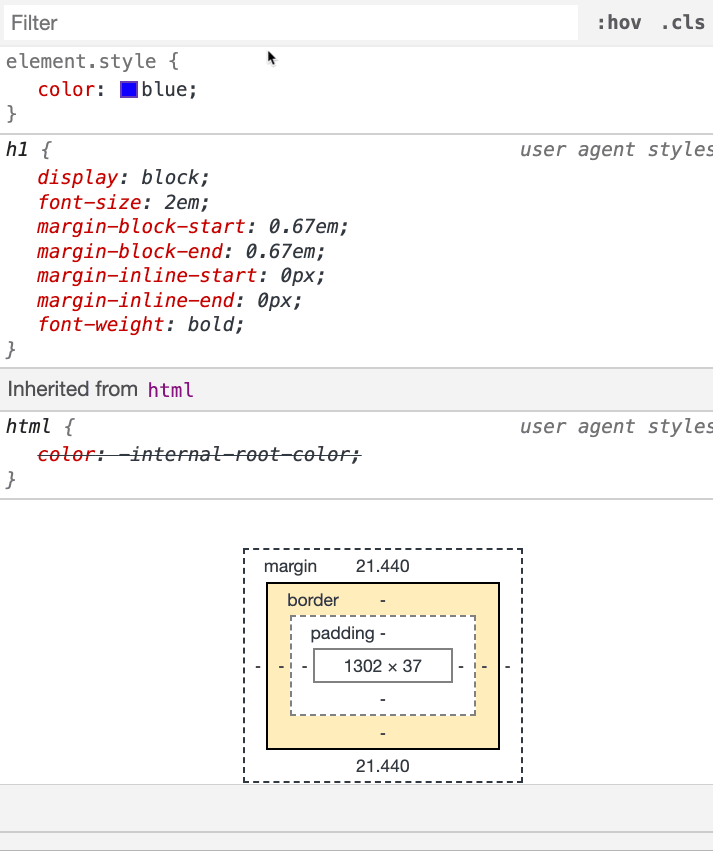

# Giving HTML some style 😎

> Our HTML is rather plain. Let's use CSS to give it some style 😎.

In the last several blog posts, we looked at HTML. We learned what it was, what it's used for, and played with some basic syntax.

Admittedly, all the examples in the HTML articles didn't look very good. They were rather dull, with no color or unique <span style="font-family:cursive">font</span>. We're going to change that by introducing **CSS**.

CSS works hand-in-hand with HTML to give your web page "style."

## What is CSS

Cascading Style Sheets, better known as **CSS**, is a stylesheet language.

You may be asking yourself, why two different languages: HTML _and_ CSS? Without getting into the history of it all, the simple answer is that each has a role. Where HTML defines the structure, CSS gives the structure _style_.

Style includes things like **color**, **font**, **size**, **layout**, and **position**. Need to make a paragraph blue? HTML defines the paragraph, and CSS makes the paragraph blue.



## Our first introduction to CSS

The best way to get familiar with CSS is to play around with it. We will use both the Chrome DevTools and your text editor to add style to an HTML document.

In fact, the HTML document we are going to use is the final version of the "html-practice.html" we used in yesterday's article.

#### Exercise: Play with CSS in the DevTools

In case you no longer have the "html-practice.html" file, you can download a new one this time called [`css-practice.html`](https://raw.githubusercontent.com/fullstackio/30-days-of-web-development/master/day-09/src/css-practice.html).

1\. Open this file in your Chrome browser, and open the DevTools.

T>The keyboard shortcut for opening the DevTools in Chrome is `cmd + alt + j`. Control instead of command for Windows users.

When you get the DevTools open, navigate to the Elements panel, and click on the `<h1>Heading Size 1</h1>` element.



2\. As mentioned in the [Day 2 blog post](#stitching) the DevTools' Elements panel is similar to a stitching; it's the ugly backside part.


Not only does the Elements panel show the HTML, but it also shows the CSS being applied to the HTML elements. You can see the CSS applied to any given HTML element by selecting the element, and then looking at the Styles pane.



With the `<h1>Heading Size 1</h1>` element selected, in the Styles pane, let's make the text blue.

In the section just above where the Styles panel lists the CSS being applied to the `h1`, add the following:

```css
color: blue;
```

Just like in the following gif (pronounced Gif, as in giftware)[^gif].



3\. Browsers recognize named colors[^named] - like "blue" - but they also accept colors in hexadecimal (HEX for short), RGB, HSL, and HSLA. We won't go into the details of these here, but I do want to show you how you can use the DevTools color picker to play with these various color types.

I>An excellent resource to learn more about the various color types can be found on W3School's website [here](https://www.w3schools.com/cssref/css_colors_legal.asp).

Click on the "blue" square in the Styles pane (you need to click on the square, not the text). When you click on it, something called the Color picker will come up.



Play around with the color-picker and experiment with the different colors and color types.

There is a lot you can do with the Styles pane and CSS. When you eventually find yourself problem-solving or trying to modify CSS for a project, the Styles pane will become one of your most powerful tools.

### What's next?

Tomorrow, we'll look at how to add CSS to an HTML file.

[^gif]: I know that the creator of gifs, pronounces this word as "jif," as in the word Jiffy. But founder or not, he's wrong. It's gif. End of story.
[^named]: You can find all the named colors [here](https://www.w3schools.com/cssref/css_colors.asp).
