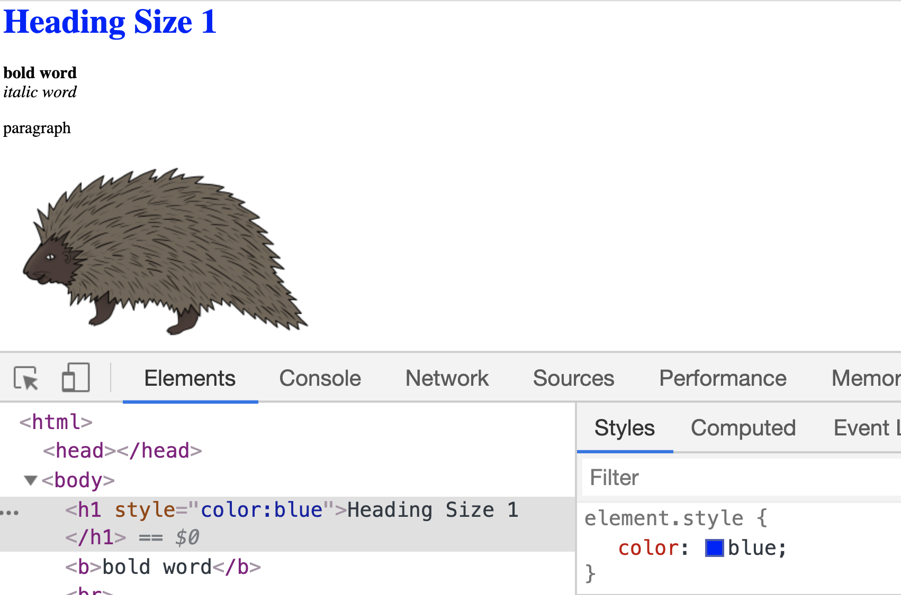
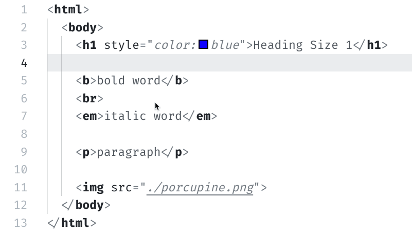

# CSS and HTML together

> But how do we get CSS onto a web page?  There are three basic ways of adding CSS to a web page: Inline style, Internal and External stylesheets. 

Yesterday we played with changing the color of an HTML element via the DevTools.

Today we're going to look at how you add CSS to a web page.

## How do you add CSS to a web page?

There are three basic ways of adding CSS to a web page.

1. Inline style
2. Internal stylesheet
3. External stylesheet

### 1. Inline style

One way to add CSS to HTML is via **Inline style**. Inline style adds CSS directly inside any HTML element. To do this, you use the `style` attribute[^attr] on the HTML element you want to add style to.

For example, here is our Heading element with the color <span style="color:blue">blue</span> added via Inline style.

```css
<h1 style="color: blue">Heading Size 1</h1>
```

**Inline** here means what it sounds like: the style is applied _in-line_ with the element.

You can apply CSS this way to any element.  However, because of the way CSS rules sort themselves out, inline styles are generally avoided, especially in more complex projects.

#### Exercise: Inline Styles

1\. Open up the "css-practice.html" file from yesterday.  If you don't have it open, here's a [quick link.](public/src/css-practice.html)

On row 3, add the Inline style to the heading element, such that it reads like the following:
```html
<html>
  <body>
      <h1 style="color:blue">Heading Size 1</h1>
```

Save your changes.  Open the HTML document in your Chrome browser and see the heading element change. 

Additionally, if you open your Chrome DevTools, you'll see that the `color:blue` is now added the `h1` styles.




### 2. Internal stylesheet

The second way to add CSS to an HTML file is within an HTML element called the **style** `<style></style>` element.  Not to be confused with the "style" attribute used in Inline styles.  They are very similar, but one is an attribute, and the one here is an element.

This approach requires that you add the style element _inside_ something called the head element.  You'll learn more about the head element along with the other boilerplate HTML elements as you continue your studies.  I recommend the [W3School's page](https://www.w3schools.com/tags/tag_style.asp) on the style tag if you're interested in learning more.

To use an Internal stylesheet on our "css-practice.html" file we need to both add a `<head></head>` element and the `<style></style>` element. 

T>There are some small syntax differences between adding Inline style vs. the other methods.  Unlike Inline styles, Internal and External stylesheets require you identify the element you want to add the style to and then surround the CSS in curly braces.  The syntax is important, and something you'll grasp with more practice.

Here's a gif showing how I added an Internal stylesheet to the "css-practice.html" document.  



I removed the Inline styles as it trumps Internal styles. If I did not remove the Inline style you would not see our color change.  This trumping/sorting comes from Cascading, something you'll want to learn more about, but we won't cover here.

Here are the HTML and CSS I added.  Feel free to copy-paste this snippet into the HTML file as I did in the gif.

```html
  <head>
    <style>
      h1 {
        color: orange;
      }
    </style>
  </head>
```

The benefit of an Internal stylesheet is that it allows you to add a bunch of style to the various HTML elements in the document you're working on.  However, th  is again is not the preferred method as it takes up space and doesn't make sense for larger projects with multiple pages of HTML.

### 3. External stylesheet

The preferred method for most projects is to add CSS via the External Stylesheet.

I>In practice, you often find a combination of these three methods being used.

If you add CSS via an External Stylesheet you are telling the browser to go download another file that has all the style rules; hence "external."  You do this by adding a `<link>` element with an `href` attribute pointing to the CSS file.

And just like how the `<style></style>` element was nested or _inside_ the `<head></head>` element, our `<link>` element also goes inside the head element.

In the following example, the `<link>` element is telling the browser: use the file called "external-stylesheet.css".

```html
<head>
  <link rel="stylesheet" type="text/css" href="external-stylesheet.css">
</head>
```

To keep things brief, we will not be making an External stylesheet, but I have included one that you can practice with - [see here](public/src/external-stylesheet.css). To use this External stylesheet make sure it's in the same folder as your "css-practice.html."  On the External stylesheet, I have added a couple of basic CSS styles to play with.  Amend, break, and play with this external-stylesheet.css as you see fit.

Here is the [css-practice-final.html](public/src/css-practice-final.html) with the internal, and external stylesheets added if you'd like to look.

### What's next?

Whew 🤯 - that was a lot.  If it all still seems a little foggy, don't worry, it will get easier.  CSS is not something you get in one day, or from a couple of blog posts.

Tomorrow, we'll look more at CSS syntax.

[^attr]: We won't cover attributes here, but I cover them in 📗 How to Become a Web Developer: A Field Guide, or you can read [this resource](https://www.w3schools.com/html/html_attributes.asp) by W3Schools.