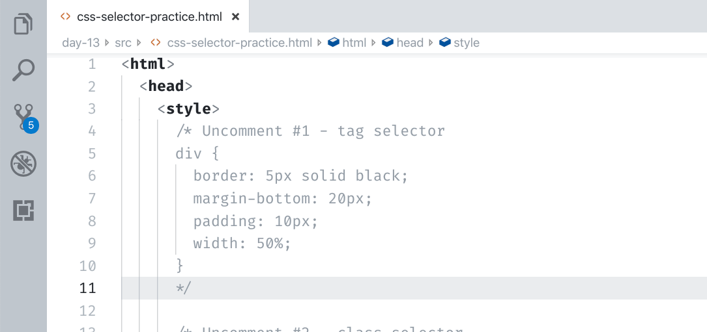
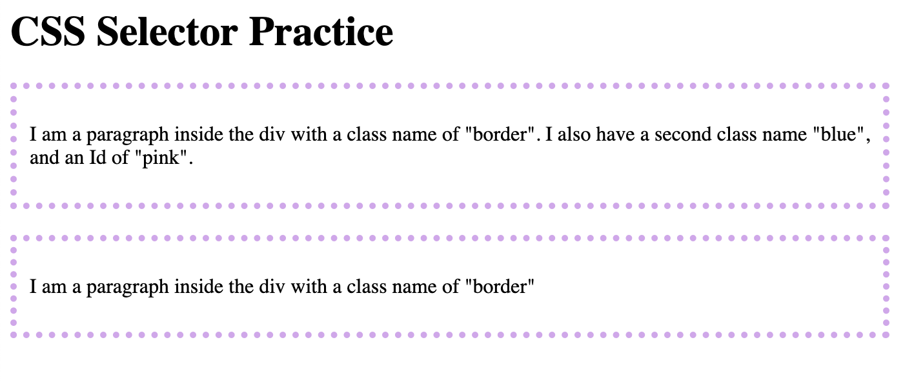
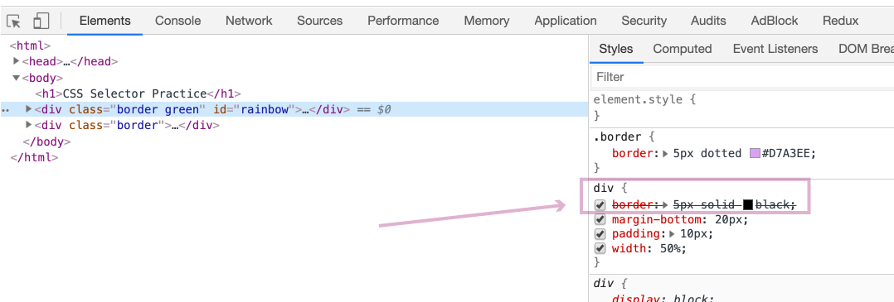
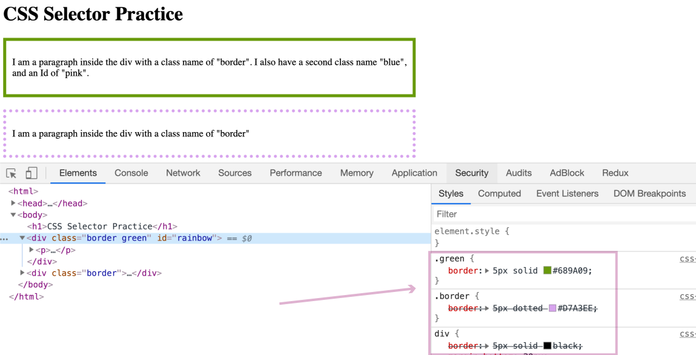
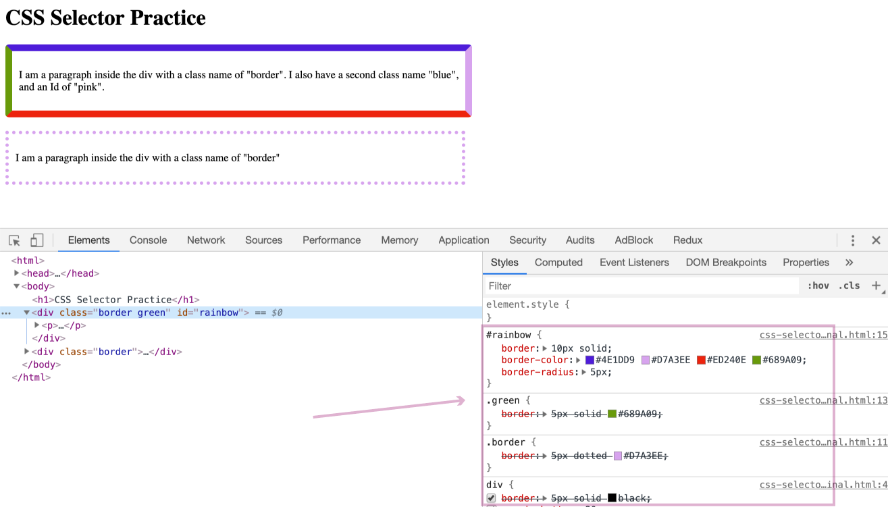

# Day 13 - Playing with CSS Selectors

To get more comfortable with Selector Specificity, let's revisit our "css-practice.html" document.  I've gone ahead and added a couple more elements, some that now have class names and one with an Id.  I've also modified the Internal stylesheet so that we have "Uncomment sections" like we did in Day 8 when we played with HTML.

1\. Go ahead and open this new file that I am now calling: [`css-selector-practice`](src/css-selector-practice) in your text editor and a Chrome browser window. 

2\. Like in our HTML uncomment practice we will be uncommenting the CSS sections one by one, and then discussing what happened.

Go ahead and uncomment #1, save the changes, and refresh the browser window.

This first example is using Tag selectors.  Specifically, it is targeting all `div` tags.  We haven't used div yet in any of our examples, but they are very helpful in organizing HTML. In short, div tags define a section of HTML[^div].

We are using the Tag selector here to add a black border around all div tags.

3\. Next, we'll uncomment #2, but before we do see if you can predict what will happen. Hint: Class selectors trump Tag selectors.

OK, with your prediction made, go ahead an uncomment #2, save your changes, and refresh the browser window.

You should see something like the following:

Because the Class selector is _more_ specific than the Tag selector, the dotted pink border is what is applied.

If you open the DevTools, you can see the black border CSS is crossed out, indicating that a more specific selector has overriden it.

4\. Next, let's uncomment #3, and again, try and predict what is going to happen before seeing the changes.  Something to keep in mind is that you can chain class names.  In this example, the first div has two class names: "border" _and_ "green."

After uncommenting, saving your changes, and refreshing you'll see that only the first div has the green border, where the second has kept the pink dotted border. The use of multiple class names has made the green border more specific than just the one, and thus the green border trumps the pink.

5\. The last step, let's uncomment #4, but again try and predict what is going to happen first.  Remember, Ids trump both Tags and Class selectors.

Well, that's fun, I mean, who doesn't like rainbows 🌈?

The key here is that, yes, Ids trump them all, _but_ they can only be used one.  Just like Max's name in our Friends analogy in yesterday's article.

I>You can find a final version of the "css-selector-practice.html" document [here](src/css-selector-practice-final), without any of the comments.

That's it for today.  Hopefully, you have a better understanding of how CSS selectors affect how the browser determines what CSS to apply.  If you'd like to learn more, I recommend one of my favorite go-to CSS websites, "CSS-Tricks".  They have a [solid article](https://css-tricks.com/multiple-class-id-selectors/) on Selector Specificity that augments much of what I've discussed here.

Tomorrow, we'll wrap up our CSS discussion by looking at CSS units.  If you've been wondering what the `px` means when I do something like `padding: 50px`, your confusion will be assuaged in tomorrow's post.

[^div]:If you'd like to learn more I recommend W3Schools web page on them [here](https://www.w3schools.com/tags/tag_div.asp)