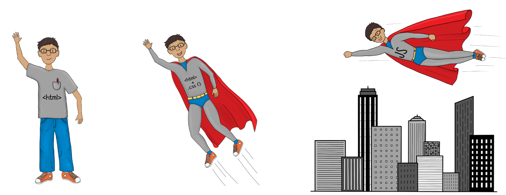
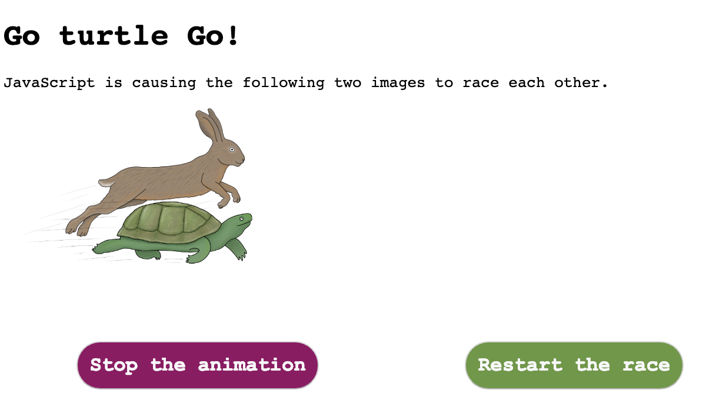
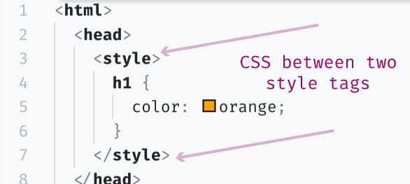
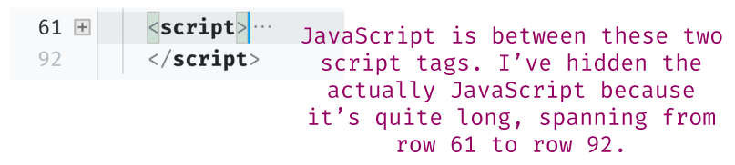
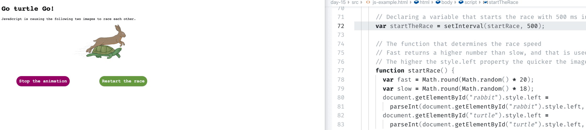
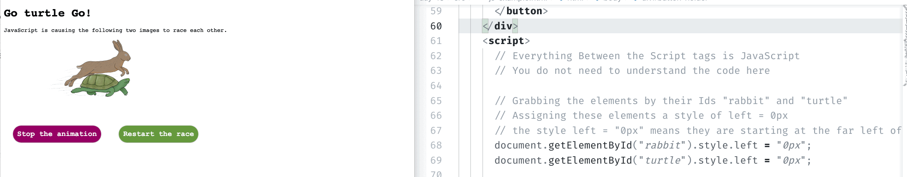
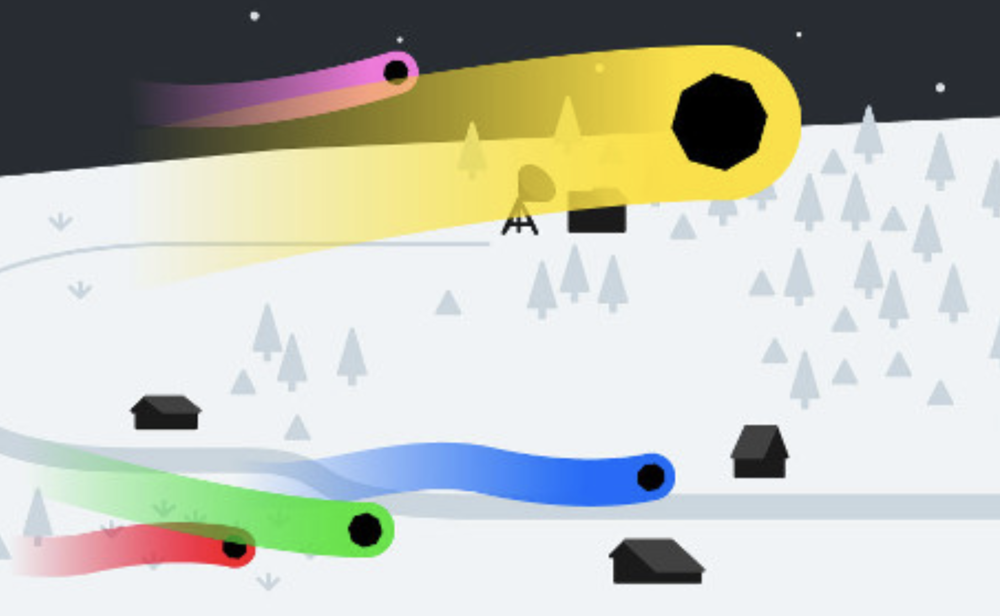

# Day 15 - Adding Interactivity

HTML gives the web structure. CSS provides that structure with style.  **JavaScript makes that structure *interactive***.

Today, I'll introduce you to JavaScript and give you a better sense of what I mean by "interactive."

T> **JavaScript is a programming language**, unlike HTML and CSS, which are markup languages. We will learn more about Programming Languages in a later blog post.

#### Exercise: What does "interactive" look like? 

What do I mean when I say "JavaScript makes that structure (HTML) interactive"?  To help answer that question, I've created an HTML file that uses JavaScript to add interactivity in the form of a turtle 🐢 and rabbit 🐇 racing each other.

1\. Because this HTML file uses two images, you need to download the following [folder](src), and then right-click to open the "js-example.html" file in Chrome.

Once open, you should see a web page that looks something like the following:

The turtle 🐢 and rabbit 🐇 will start racing right away.  Play around with stopping and restarting the animation.  

3\.  The "racing" between the turtle and rabbit, as well as the buttons "stopping" and "restarting" the race, are all done by JavaScript.  This is an example of what interactivity looks like.

T>If at any point the race annoys you or you can no longer see the animals, restart and/or stop the animation using the buttons.  No offense will be taken.

4\. Next, I'm going to have you change some values on the JavaScript written on the "js-example.html" file.

I>You will be changing the JavaScript, but I will not stop to explain the syntax.  My hope is to have you focus on what the JavaScript is doing.  Not on how it is doing it or how it is written.

Go ahead and in your text editor, open the "js-example.html" file. 

Navigate to row 61.  This is where the JavScript starts.  Similar to CSS, you can add JavaScript on an HTML file by inserting it between a special HTML element.  With CSS, this was called an Internal Stylesheet, and we did this by adding CSS in the `` element. 

**Internal CSS Example:**

For JavaScript, instead of using the `` element, we use the `` element.

**Internal JavaScript Example:**

5\. Next, in your text editor, navigate to row 72.  We are going to change the "speed" of the race by changing a value here.  Change the 500 to 100.  Remember to save your changes, and then refresh the browser window.

500 here means 500 milliseconds between each time JavaScript changes the position of the rabbit and the turtle.  By making this number lower, to 100 milliseconds, we speed up the race because JavaScript is now changing the positions every 0.1 seconds instead of every 0.5 seconds.

6\. Next, in your text editor, navigate to row 69.  This snippet of JavaScript is essentially grabbing the turtle image and assigning it a starting position.  Again, we won't go into syntax details here. 

By setting the turtle's starting position and CSS unit `"0px"`, the turtle is starting on the left-hand side of the screen.  We are going to change this to `"200px"` to help give the turtle a bit of a head start (200px head start to be exact).

Go ahead and on row 60, change `"0px"` to `"200px"`.  Press save, and refresh the browser window.  You should see that the turtle now has a bit of a head start.

### More impressive "interactivity" examples

My turtle 🐢 and rabbit 🐇 racing example is an admittedly unimpressive example of what JavaScript is capable of. To leave you a little more impressed, the following are additional examples of JavaScript doing what it does best: making things interactive.

I'd encourage you to navigate to these websites and play around a bit.  The screenshots do not do them justice.

#### [Histography](http://www.histography.io/)
*http://www.histography.io/*

Using JavaScript[^histography], this site pulls event data from sources that include: Wikipedia, Google image and, YouTube.

It consumes the data and then makes it visually appealing and digestible to see 14 billion years of time.

#### [Multeor](http://multeor.com/)
*http://multeor.com/* 

Written in JavaScript, Multeor is a multiplayer game that allows you to control a meteor crashing into the earth.  Don't be fooled; you're not trying to save the earth 🌎, but rather leave the biggest path of destruction.

Multeor is impressive because most online games use other technologies/programming languages to handle complex animations. But Multeor, written in plain JavaScript, proves how powerful plain JavaScript _can_ be[^node].

I>I use the word "plain" to describe JavaScript, because, as we'll learn later, there are lots of libraries and frameworks that build-off of JavaScript, enhancing the language.  When I say "plain", I mean written in pure JavaScript, not using one of these libraries or frameworks.

### What's next?

Next, we'll look at what makes JavaScript so important (hint: it's EVERYWHERE).

[^histography]: According to various tech stack websites, Histography uses the jQuery library, which is a library built on-top of JavaScript. For those that have worked with jQuery, this blows my mind 🤯.
[^node]: Multeor uses Node.js, which manages communications between the devices using WebSockets.