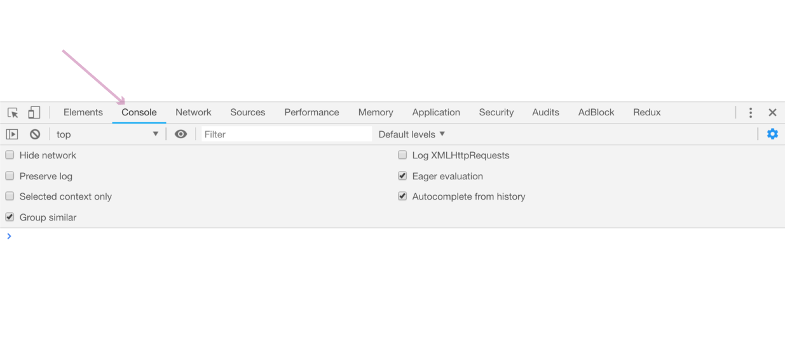
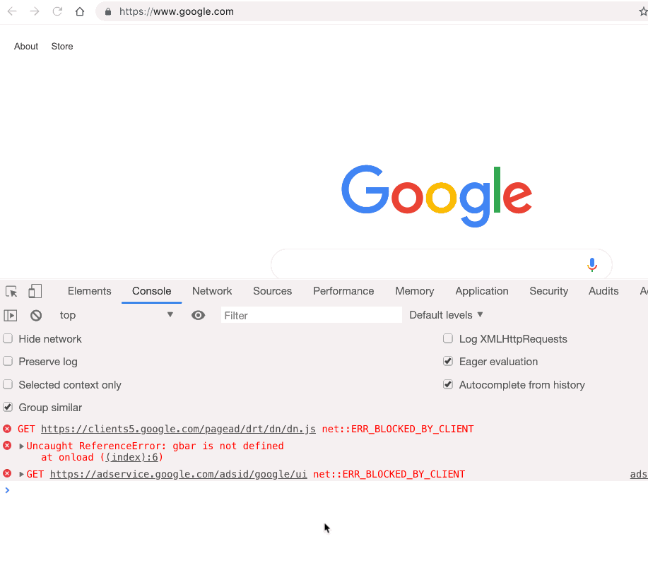
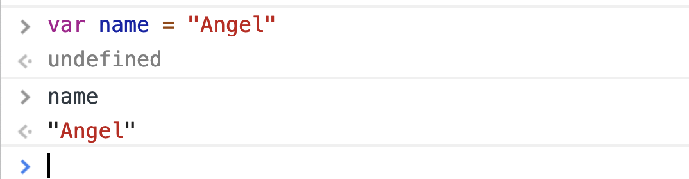
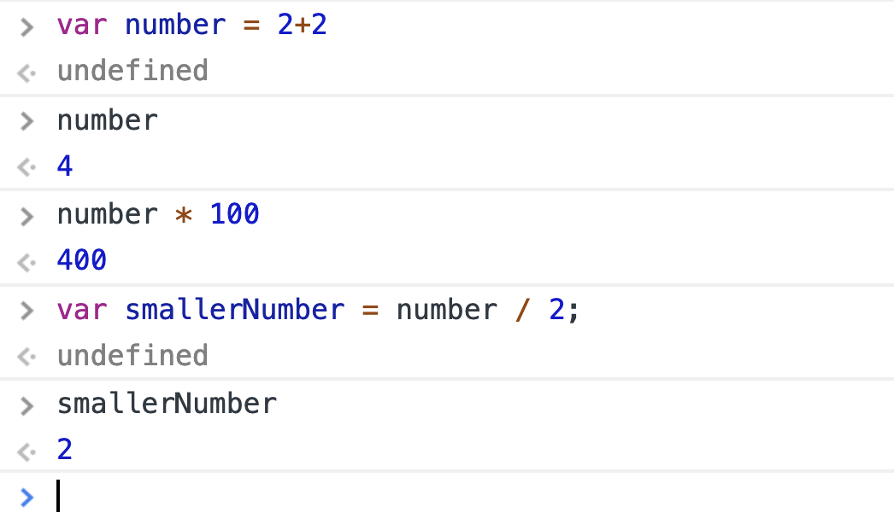
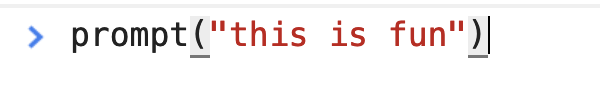
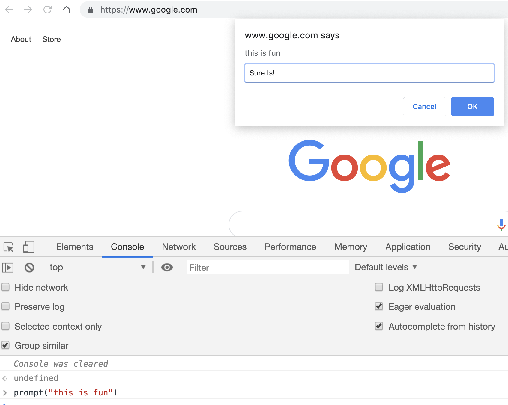
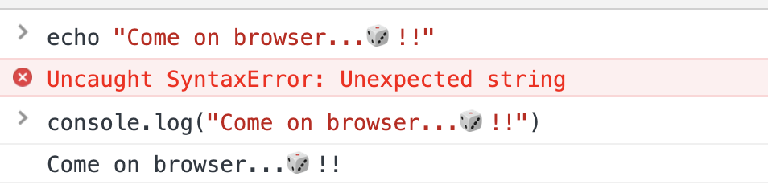

# JavaScript in the DevTools

> One of the best ways to start learning JavaScript is by playing with it in the DevTools.

There is no way I could reasonably teach you all you need to know about JavaScript in a couple of blog posts. Instead, I am going to show you some JavaScript code snippets, and show you that they can be executed in the DevTools' Console.

My hope is that by seeing and playing with some simple JavaScript, the syntax starts to become a little familiar, and JavaScript a little less foreign.

### JavaScript in the DevTools' Console

All major web browsers come shipped with JavaScript[^majorbrowsers].  Without getting into too many details, what this means is that the browser can *read* and *run* the JavaScript language[^jsengine].  

For us, this also means that we can type JavaScript directly into the browser's DevTools' Console and it will read and run JavaScript on the fly.  If we tried to do this with another programming language, say like Java, the Console would return a bunch of errors.

#### Exercise 3 of 12: JavaScript in the Console
1\. In Chrome, open any window.  Honestly, it doesn't matter which web page or HTML file you have open, just have one open.

Next, open the DevTools (cmd + alt + j).

2\. Navigate to the **Console**.  You'll find this panel just to the **right** of the Elements panel.



If you see errors, like in the following screenshot, use the `clear()` command to remove them. These errors are meant for developers working on the web page you opened.  For our purposes, we can ignore and clear them out of the way.



3\. The **Console** is a panel in the DevTools where Chrome executes commands that you type.  You can type JavaScript into the Console, and the browser will process it. The Console is not unique to Chrome.  All major browsers have one.  

4\. Go ahead and type the following commands into the Console.  Press **enter** to execute the command.  

I>In the following screenshots, you will see the word `undefined`. This is what the browser returns after declaring a variable.  We don't need to know why that is, just know that the screenshots will include what the browser returns.  I point this out, so you don't think you need to type `undefined`.  You should be typing what follows the symbol `>`, and the computer's response follows the symbol `<`. 

For the following command, go ahead and replace `Angel` with your name. 



T>I am using screenshots here instead of a code snippet in a passive-aggressive maneuver to get you to type the commands instead of copy-pasting them.  The reason, so you learn by doing. You're welcome 😇.

5\. The next couple of commands perform simple JavaScript calculations.  Go ahead and type these in the Console as well.  



6\. Next, we'll trigger a prompt message (a window that opens up asking you to fill something in).  To do this, type the `prompt` command into the Console with a message.



Now enter a response in the prompt that pops up and click "OK." Look back in the Console.  You should see your response.



The above exercises are designed to get you familiar with playing with JavaScript in the Console.  Don't get caught up on the syntax; get comfortable with executing JavaScript in the Console.

I've already talked a bit about how the browser can read JavaScript, and that this is not the case for other programming languages.  To help bring this point home, try typing the following PHP code snippet into the console.  PHP is a top ten programming language, which we will learn more about in a later blog post.

```php
echo "Come on browser...🎲!!";
```

You'll get an error.  Now try the JavaScript equivalent of the PHP `echo` command, `console.log()`.



**SCORE:** PHP 0: JavaScript 1.

### What's next?
The point of this blog post was to introduce you to JavaScript, and show you that the browser can interpret it.  Which, as we saw with PHP, is not the case for other programming languages.

Tomorrow, we'll dive into more detail about what a Programming Language is.  Remember JavaScript is a Programming Language, HTML and CSS are not; they are Markup Languages.  Why this is, will become clearer in tomorrow's blog post.

[^majorbrowsers]:https://www.enable-javascript.com/
[^jsengine]:https://en.wikipedia.org/wiki/JavaScript_engine