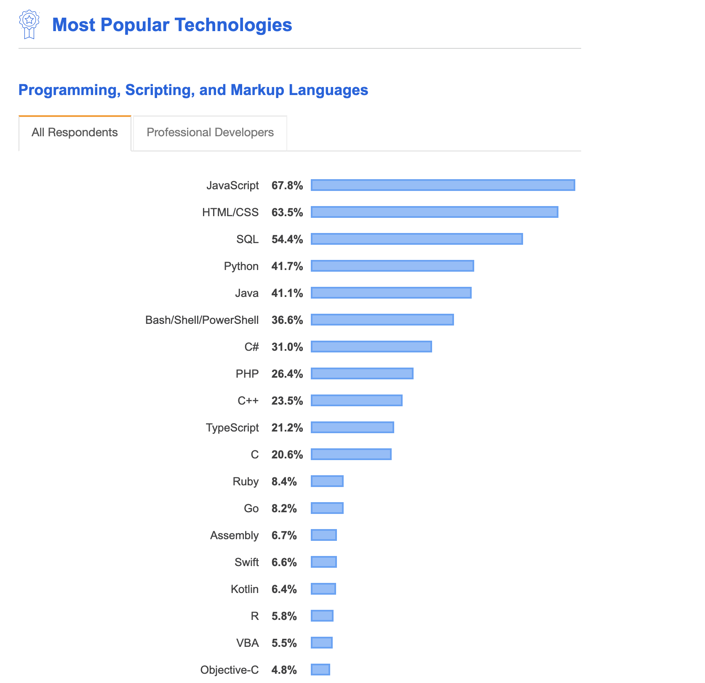
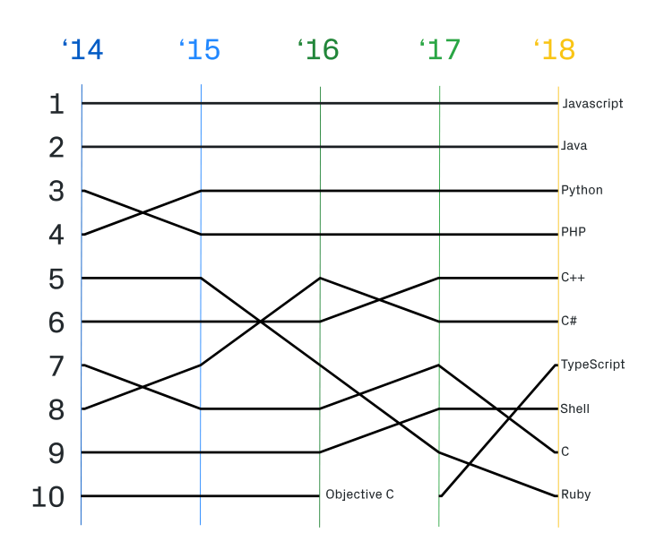
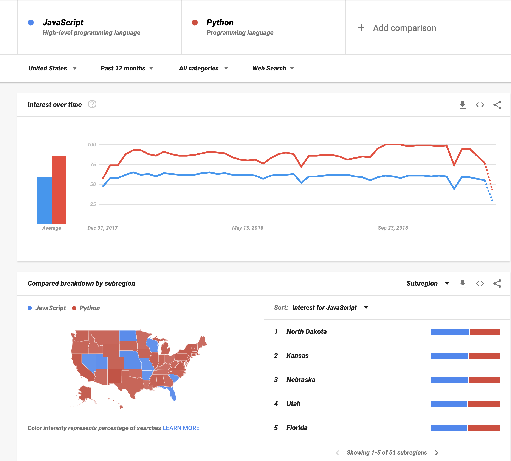
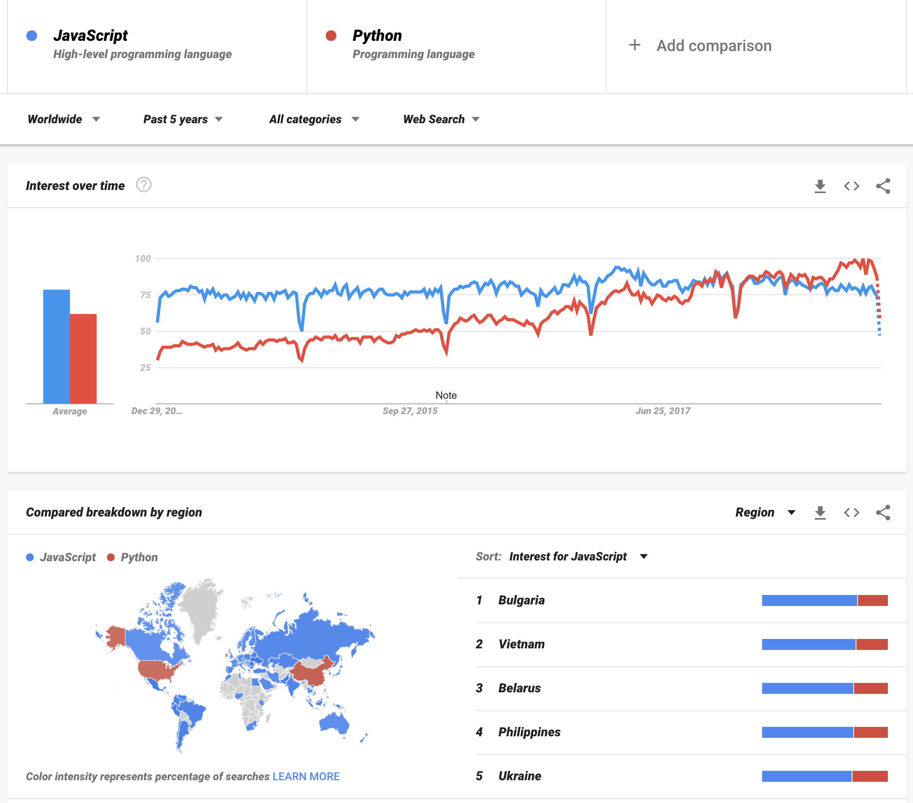
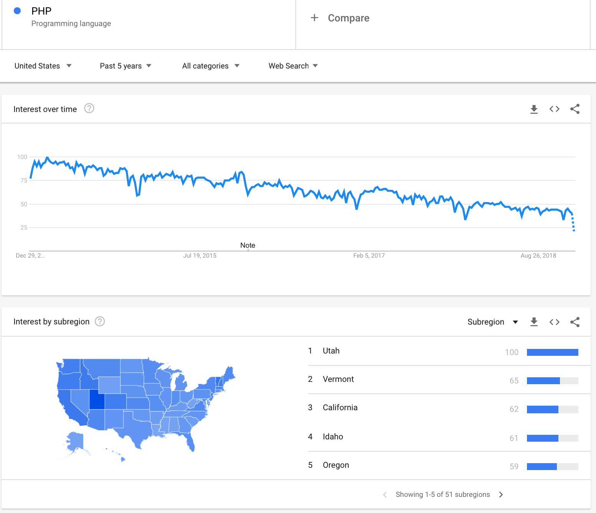

# Top 10 Programming Languages

> How do you know what Programming Language to learn? Do you need to learn more than one Programming Language, and if so in what order should you learn them?

While I can't answer these questions for you, I _can_ give you the resources and some guidance so you can answer those questions for yourself.

In today's post, we will discuss the **state of Programming Languages**, which ones are the most heavily used, and what they are used for.

## How do I know what Programming Language to learn?

You can approach this question a couple of different ways. One is to look at the most popular Programming Languages. Several helpful resources collect information about Programming Language popularity/use[^tiobe]. We will look at two: Stack Overflow's Developer Survey Results[^insights], and Github's Octoverse survey[^octoverse].

**Stack Overflow's Developer Survey Results: Popular Technologies**

**Github's Octoverse: Top Languages Overtime**

Stack Overflow includes non-Programming Languages, like HTML, CSS, and SQL.  Also, Stack Overflow looks at the last year, 2019 at the time of writing. Github looks at the last 4 years, and _only_ includes Programming Languages.

You can see some patterns between the Stack Overflow and Octoverse charts. The most obvious is that JavaScript is at the top of each list. This shouldn't be a surprise after learning about JavaScript in the previous blog posts.

**Java** and **Python** are also growing in popularity. Python, in particular, has gotten lots of buzz recently[^fastest-growing].

**Ruby's** popularity seems to be going down, and the new kid on the block is something called **Typescript**.

To get an even better picture of what's happening, let's use Google Trends, which tracks Google searches. In Google Trends, you can define the search term, period, and location. We will play around with these options, investigating and comparing different Programming Languages in the next exercise.

#### Exercise: Looking at Programming Languages on Google Trends

1\. Open the [Google Trends website](https://trends.google.com/trends/).

2\. If you haven't played with Google Trends, get ready to have some fun. For someone who likes data, Google Trends is one of my favorite websites.

Let's start by comparing Python on a US level - [see chart here](https://trends.google.com/trends/explore?geo=US&q=%2Fm%2F02p97,%2Fm%2F05z1_).

You can either click the link I've included or if you'd like, type JavaScript and compare it with Python. Make sure you select the "Programming Language" term though and not just the word "Python." Otherwise, you'd be comparing JavaScript to the snake 🐍.

I am using the default search settings, which has me looking at the US in the last 12 months.

**JavaScript vs. Python, US, last 12 months**

Notice that even though JavaScript is the more "popular" Programming Language, Google Trends shows that Python is searched more often. Stack Overflow uses a survey of developers to gather its data[^somethod], and Github bases its data on the "amount of code written" type measurements[^githubmethod]. This upturn in Python searches _may_ support the buzz that Python is on the up-and-up.

3\. Let's switch it up and look at JavaScript vs. Python, but this time **worldwide**, and over the **last 5 years** - [see chart here.](https://trends.google.com/trends/explore?date=today%205-y&q=%2Fm%2F02p97,%2Fm%2F05z1_)

**JavaScript vs. Python, Worldwide, last 5 years**

Looks like not long ago, JavaScript used to be _more_ searched than Python! Additionally, there are still lots of countries where folks search more for JavaScript than they do Python.

It's impossible to explain these differences completely.  But it's a good guess that Python is "growing" in popularity, and the rate at which it's growing varies depending on where in the World you are.

5\. Now let's look at **PHP**, **in the US**, over the **last 5 years** - [see chart here](https://trends.google.com/trends/explore?date=today%205-y&geo=US&q=%2Fm%2F060kv). Github and Stack Overflow shows that PHP isn't growing, but it is not totally obvious if PHP's "popularity" is decreasing.

**PHP, US, last 5 years**

Google Trends gives a little more insight into what's going on with PHP. Depending on how much weight you give searches of "PHP," it is a reasonable guess that PHP's popularity _is decreasing_.  Or, at least there's some evidence that suggests it is.

Another interesting tidbit is the popularity of PHP in Utah. I can't explain this entirely, other than to say that Utah has become somewhat of a Silicon Valley of the Rocky Mountains.  Utah has a large population, with Universities and a relatively low cost of living. Companies like eBay and Adobe have all recently opened large branches in the state[^utah].

Feel free to do more Google Trend searches. Play around with other mentioned Programming Languages from the Github and Stack Overflow reports. Google Trends allows you to get more specific based on region, so it might be worth trying to narrow down trends closer to your home base. Also, try searching for things like "PHP web developer jobs," etc.

## What's next?

OK, now we have a sense of what Programming Languages are popular.  But popularity still isn't enough to decide what language(s) to learn; being an Alaskan Crabber 🦀 could be super _popular_, but that doesn't mean you want to live your days cold and on a boat ⚓.

Our next step is to look at what these top Programming Languages are used for. And hopefully, through this investigation, I can give you a better sense of what language(s) you'd need based on your interest, future or otherwise.

This will be our task in tomorrow's blog post.  I will cover the top 4 most popular Programming Languages (according to Github's Octoverse).

[^tiobe]: One could also look at the [TIOBE Index](https://www.tiobe.com/tiobe-index/)
[^insights]: https://insights.stackoverflow.com/survey/2019/#technology-programming-scripting-and-markup-languages
[^somethod]: https://insights.stackoverflow.com/survey/2018/
[^githubmethod]: https://octoverse.github.com/projects#languages
[^utah]: https://www.cnbc.com/2016/07/13/a-high-tech-mecca-rises-to-rival-silicon-valley.html
[^octoverse]: https://octoverse.github.com/projects#languages
[^fastest-growing]: https://stackoverflow.blog/2017/09/06/incredible-growth-python/?_ga=2.115552772.385778221.