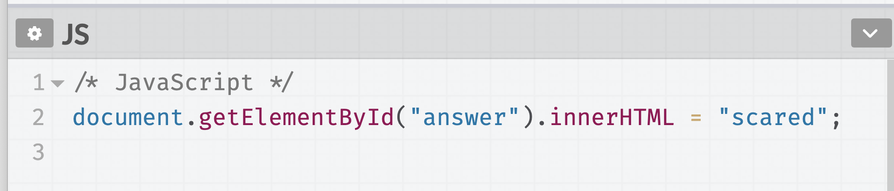
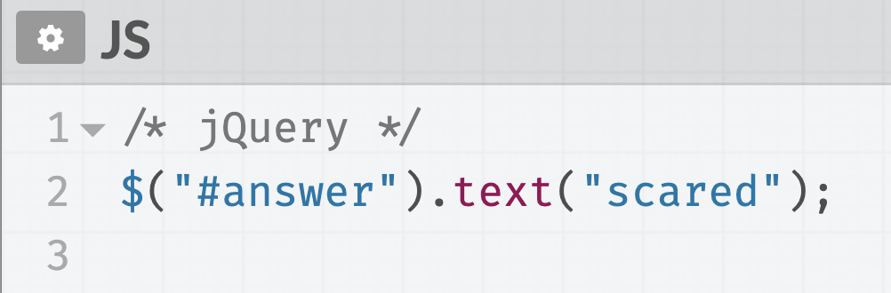
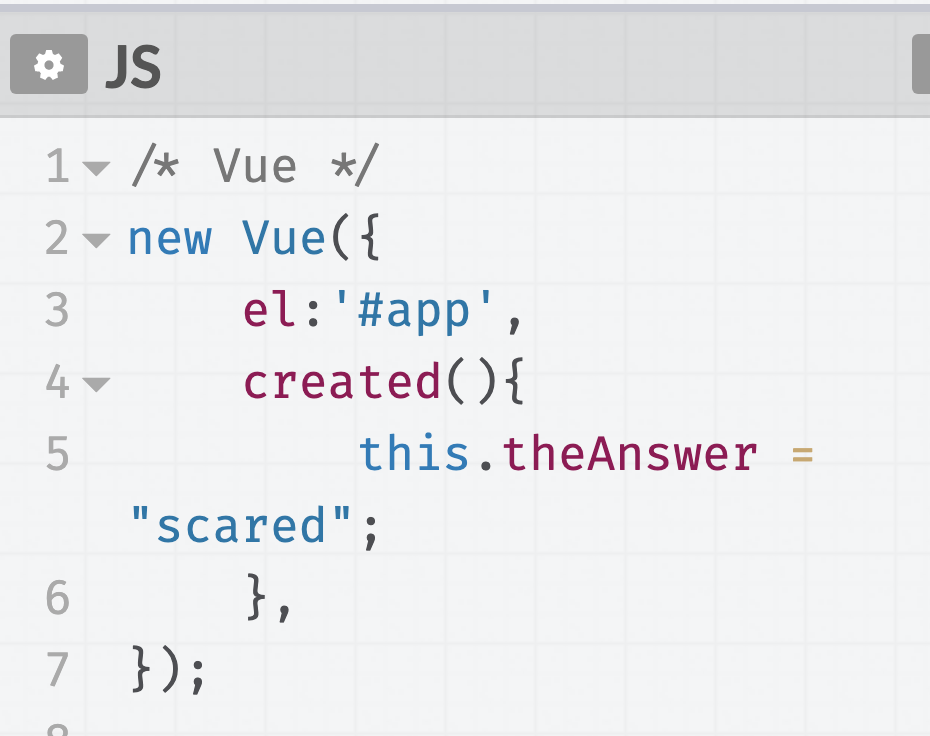

# Frameworks and Libraries

> To get in front of what might later become confusing, I want to stop and quickly talk about **Frameworks and Libraries**.

You'll often hear people refer to _Frameworks_, _Libraries_, and _Programming Languages_ as if they were all the same.

They are not. **They are different things**. Not making matters any better, the lines between a "library" and a "framework" aren't always clear.

For example, you may come across a job post requiring skills in PHP, React, and Angular.

- PHP is a Programing Language
- Angular is a Framework (made of up several Libraries)
- React could also be considered a Framework, even though there is a specific `React` library.

### Defining Frameworks and Libraries

> **Frameworks and Libraries are a collection of tools that support writing in a particular Programming Language**.

For example, the popular Library called React was built by Facebook. Facebook created React to help manage data and make maintenance of their codebase more manageable[^whyreact]. React **extends** JavaScript, but it does not replace it. Therefore React isn't a Programming Language, just a tool that, in many ways, makes JavaScript more powerful.

If you haven't guessed already, I'm a fan of non-computer analogies. Thus, in keeping with this theme, a good analogy is to think of Frameworks and Libraries as netspeak. Don't know what netspeak is? I bet you do; you just didn't know it was called "netspeak."

> "LOL" = Laugh out loud
> "OMG" = Oh my god
> "FYI" = For your information
> "TBH" = To be honest

These are all examples of what is referred to as netspeak. So back to the analogy. Netspeak, is the Framework and Library of the English language. I doubt many grammarians would say that Netspeak is making the English language more powerful. But it _is_ shortening the number of characters you need to type and making it faster to communicate[^analogy].

Frameworks and Libraries have become a crucial part of Web Development. They are a topic you will learn more about as you progress in your learning.

T> **Learn the Programming Language First.** Once you have a handle on the language, then explore Libraries and Frameworks.

#### Exercise: Framework, Library, or Programming Language?

In this exercise, we are going to write the same set of instructions using the following:

1. JavaScript, the Programming Language.
2. jQuery, the Library.
3. Vue, the Framework.

Unlike JavaScript, Libraries and Frameworks need to be added to the HTML file for the code to work. Remember back on Day 10, when we talked about linking to an External Stylesheet? Adding a Framework or Library is similar. But instead of linking to a CSS file, we would link to the Framework or Library we want to use.

Below is an example of what it would look like in the HTML if we wanted to use the jQuery Library. We would have to include a link to it.

```
<script src="jquery-3.4.1.min.js"></script>
```

However, to avoid having to deal with linking to jQuery or Vue, I am going to use a program called Codepen.io for this exercise. The reason is two-fold:

- One: Codepen allows me to add the Library and Framework easily - you don't have to worry about linking to jQuery or Vue. Codepen handles this for you when you add the desired Framework or Library via the settings options.

- Two: It's a great program that can be very helpful for beginners. It's worth the introduction.

1\. Go ahead and use [this link](https://codepen.io/Monkeychip/pen/rEgoWE) to navigate to a project I started in Codepen.

Once open, you should see something like the following. My settings/look are likely different than yours, but the content is the same.


I> **Pens** are what folks refer to a small project on Codepen.io.

On the left-hand side of the screenshot, you have HTML, CSS, and JavaScript respectfully. In this example, I am using plain JavaScript to answer the question.

T>If you'd like to play with this Pen or any of the others, go ahead and create a Codepen.io account, and then "Fork" the Pen on to your account. Instructions on how to "Fork" can be found [here](https://blog.codepen.io/documentation/features/forks/). Once forked, you can play, break, and mess with the code as much as you'd like.

Notice that the JavaScript is relatively simple, just one line. The answer of "scared" you see in the browser view is being returned using this one line of JavaScript. I'd encourage you to take a moment and scroll through the HTML and see if you can understand, even on a general level, the interaction between HTML and JavaScript.



2\. Now, open this [Pen](https://codepen.io/Monkeychip/pen/zVQydY), which uses the jQuery Library.

This Pen is an example of the same functionality - filling in the answer - but this time using a library called jQuery.


The jQuery syntax is slightly different than the JavaScript syntax. It is a little shorter and easier to write.



3\. And last but not least, let's open this [Pen](https://codepen.io/Monkeychip/pen/mZYapB), which uses the Vue Framework.


This pen is an example of the same functionality, but this time using a Framework called Vue. Frameworks and Libraries are better suited for larger, more complex web pages or web applications. As a result, in this example, it looks like a good amount more work to do the one line it took us in JavaScript and jQuery.



My goal here isn't to argue for one method or the other, only to show you how the same functionality looks between a Programming Language, Library, and Framework.

As you progress in Web Development, you will no-doubt encounter and be required to use Libraries and/or Frameworks. Though not apparent here, Libraries and Frameworks _will_ make your life easier as they are meant to enhance JavaScript. dat is da honest truth.

### Summary

Some key things to remember are that Libraries and Frameworks are built off of the language they enhance. Meaning underneath the hood, they are using a Programming Language. In our examples, jQuery and Vue are using JavaScript.

### What's next?

If this felt like a detour ↪️, it's because it was. Why we made this detour will be more apparent tomorrow when we look at deciphering Web Developer job postings.

[^whyreact]: https://reactjs.org/blog/2013/06/05/why-react.html
[^analogy]: It's an analogy, so it's not a 1:1 comparison. In other words, take it with a grain of salt 🧂.
