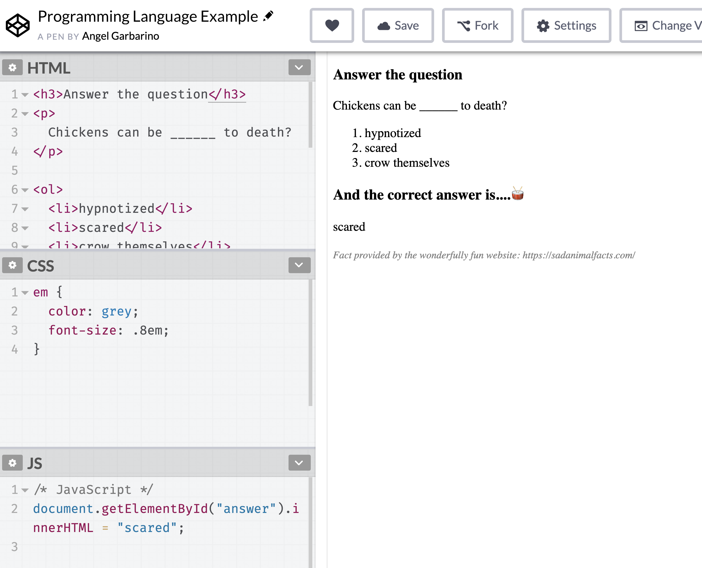
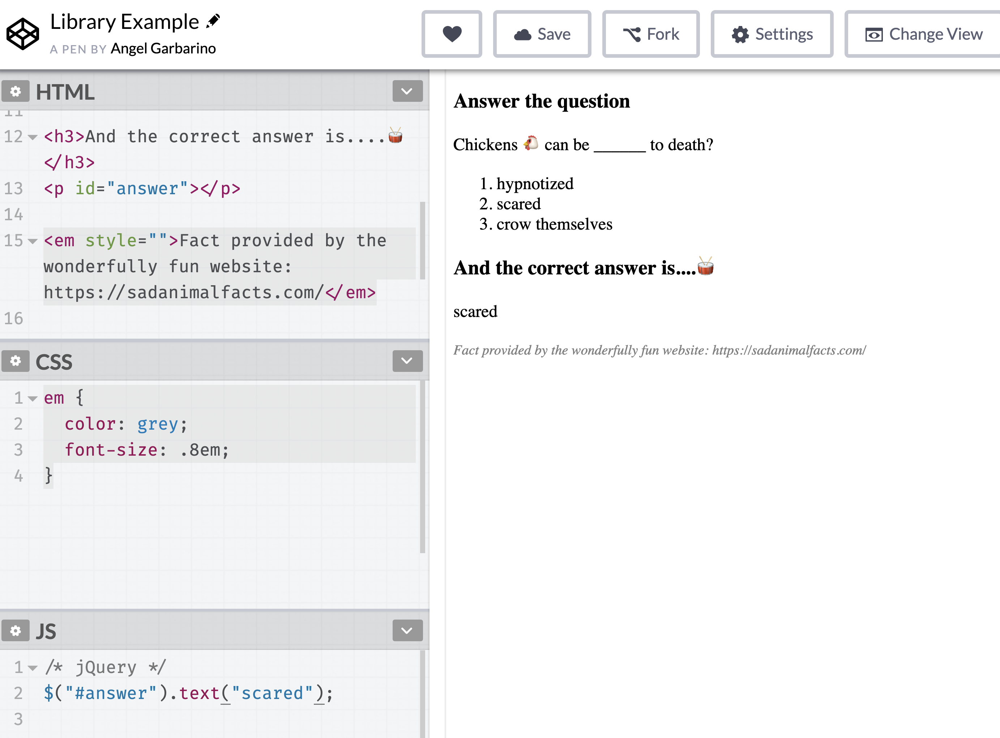
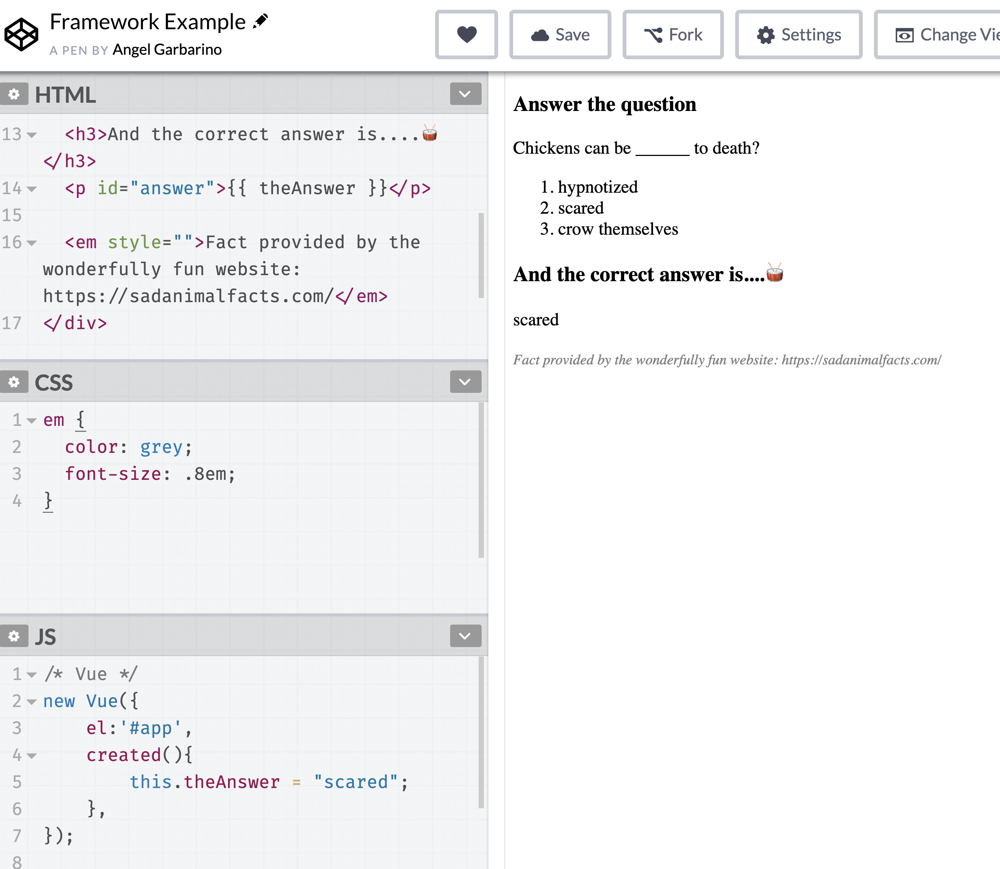

# Day 21 - Frameworks and Libraries

To get in front of what might later become confusing, I want to stop and quickly talk about **Frameworks and Libraries**.

You'll often hear people refer to _Frameworks_, _Libraries_, and _Programming Languages_ in the same breath.

But, **they are different things**. Not making matters any better, the lines between a "library" and a "framework" aren't always clear.

For example, you may come across a job post requiring skills in PHP, React, and Angular.

- PHP is a Programing Language
- Angular is a Framework (made of up several Libraries)
- React could also be considered a Framework, even though there is a specific `React` library.

**Frameworks and Libraries are a collection of tools that support writing in a particular Programming Language**. For example, the popular Library called React was built by Facebook. Facebook built React to help manage data and make maintenance of their codebase more manageable[^whyreact].

React **extends** JavaScript, but it does not replace it. Therefore React isn't a Programming Language, just a tool that in many ways makes JavaScript more powerful.

Frameworks and Libraries have become a crucial part of web development, and something you will need to learn more about as you continue.

T> **Learn the Programming Language First.** Once you have a handle on the language, then explore Libraries and Frameworks.

#### Exercise: Framework, Library or Programming Language?

In this exercise, we are going to write the same set of instructions in three different ways:

1. JavaScript, the programming language.
2. jQuery, the library.
3. Vue, the framework.

Unlike JavaScript, Libraries and Frameworks need to be added to the HTML file in order for the code to work.  Much like an External Stylesheet CSS file, which we discuss on Day 10.

I am going to use a program called Codepen.io for this exercise.  The reason is two-fold: 1. It allows me to easily add the Library and Framework.  2. It's a great program that can be very helpful for beginners.

Using Codepen.io's own words, they are a
>>>playground for the front-end side of the web.

As you'll see Codepen.io allows you, on one page, to add HTML, CSS, JavaScript.  Additionally, I'm using their "Settings" options to add the jQuery and Vue libraries on the respective pens.

1\. Open this [Pen](https://codepen.io/Monkeychip/pen/rEgoWE).

Once open you should see something like the following.  Granted my settings/look are likely different than yours, but the content is the same.

I> **Pens** are what folks refer to a small project on Codepen.io

On the left-hand side of the screenshot you have HTML, CSS, and JavaScript respectfully.  In this example, I am using plain JavaScript to fill in the answer to the question. 

T>If you'd like to play with this pen or any of others, go ahead and create a codepen account, and then "Fork" the pen on to your account - instructions [here](https://blog.codepen.io/documentation/features/forks/).  Once forked, you can play, break and mess with the code as much as you'd like.

Notice that the code is fairly simple, just one line.

2\.  Now, open this [Pen](https://codepen.io/Monkeychip/pen/zVQydY).

This pen, is an example of the same functionality - filling in the answer - but this time using a library called jQuery.

The syntax is slightly different than before.  A little shorter, and easier to write.

3\.  Last, let's open this [Pen](https://codepen.io/Monkeychip/pen/mZYapB).

This pen, is an example of the same functionality, but this time using a Framework called Vue.  Frameworks, and libraries, are better suited for larger more complex web pages or web applications.  As a result, in this example, it looks like a good amount more work to do the one line it took us in JavaScript or jQuery.

My goal here isn't to argue for one or the other, only to show you how the same functionality looks between the three. 

As you progress in web development, you will no-doubt encounter and be required to use libraries and/or frameworks.  Though not apparent here, libraries and frameworks _will_ make your life easier as they are meant to enhance JavaScript.

Some key things to remember are that Libraries and Frameworks are built off of the language they enhance. Meaning underneath the hood, they themselves are using a programming language.  In our examples, jQuery and Vue are using JavaScript.  Think of it like a journalist writing short-hand.  They are still writing in English, just, their syntax is just more concise.

Back to our normally scheduled programing, we have completed our detour on Libraries and Frameworks.  Why we made this detour will be more apparent tomorrow when we look at deciphering job postings.

3\.  Next

// ARG: add snippets of Frameworks and Libraries, with quick exercise something in JavaScript vs. something in a Framework - codepen.io.

// Next look at finding jobs.

[^whyreact]: https://reactjs.org/blog/2013/06/05/why-react.html