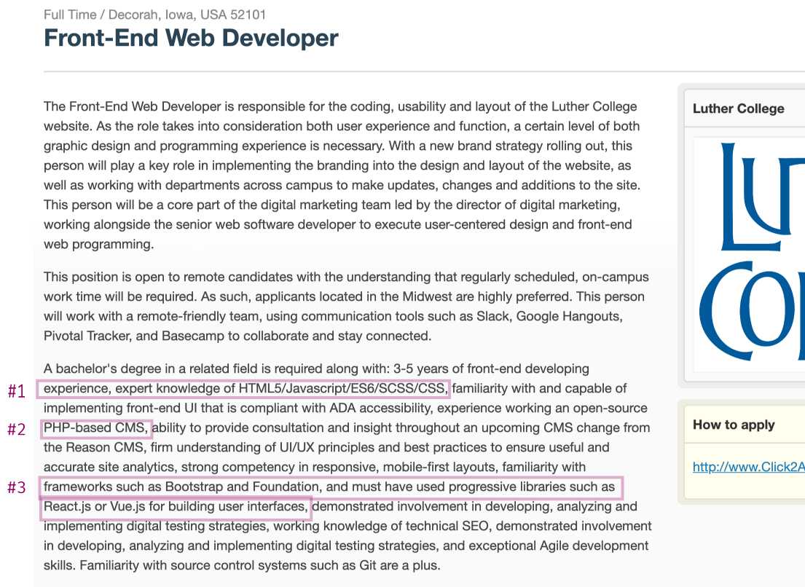

# Day 22 - Navigating Job Postings

I want to get you comfortable looking at Web Development job descriptions, and help you decipher the various language requirements.

By the end of this article, I hope you'll have a better understanding of how to read between-the lines on job descriptions, giving you a sense of what skills you'll need for specific jobs.

In this section, we will look at the following job posting sites.

I> It should go without saying that there are a TON of job posting sites out there. I choose to list these three because they post jobs specifically for developers.

- [**GitHub Jobs**](https://jobs.github.com/)
- [**StackOverflow Jobs**](https://stackoverflow.com/jobs)
- [**Smashing Magazine Jobs**](https://www.smashingmagazine.com/jobs/)

We could spend a whole day looking at different job postings, but I am going to assume that, depending on your level of curiosity, you can continue the following exercise for as long as you'd like. I am just going to get you started, picking apart one job posting and hopefully getting you started on refine a critical eye for job postings you browse later.

I>In the book How to Become a Web Developer: A Field Guide, I analyze more and different job postings, one from GitHub Jobs, StackOverflow Jobs, and several from Smashing Magazine Jobs.

#### Exercise: 
For the sack of time, I am only going to analyze one job posting, but end with some key things to look out for while job-hunting.

1\. Let's start with the Github Jobs site.  I grabbed the first one that came up, ["Front-End Web Developer, for Luther College"](https://jobs.github.com/positions/2c3fb9c8-a5e4-4352-885a-8dab924e9c00).  Below is a screenshot.  I have highlighted some sentences we'll analyze.

W>It's quite likely that by the time I publish and you read this article, the postings will no longer be available. The information we will be discussion still will be, but this is why I have included the screenshot.

**#1.** 
>..."expert knowledge of HTML5/Javascript/ES6/SCSS/CSS.."

In this posting they have lumped together HTML + CSS + JavaScript.  This is common, as these three are foundational languages for Web Developers.  Let's briefly chat about the added **ES6** and **SCSS** verbage.

In short, ES6 can be thought of as the current "version" of JavaScript.  This ES6 "version" released such significant and different improvements to JavaScript, that by adding ES6, they are confirming you are up-to-date with the latest and greatest functionality. If you're curious about what exactly ES (ecma script) means, and why I've added quotes around "version", [Wikipedia provides a through write up](https://en.wikipedia.org/wiki/ECMAScript) on the history of Ecma Script (ES) and JavaScript.

SCSS is a CSS preprocessor 🤷🏻‍♀️.  Yes, it's not enough for there just to be CSS, the community has gone ahead and developed something called preprocessor.  Where a Framework might be like a journalist writing in short-hand, a CSS preprocess is like me using an emoji to say 💩 instead of sh$t.  Technically, a preprocess is a program that lets you generate CSS from a specific and unique set of syntax rules[^preprocessor].

Exactly what a preprocessor is, or ES6, is not the point.  Instead, the take away is that this job posting is saying:
> "we want you to know at an expert level the 3 core foundational languages of the web: HTML, CSS, and JavaScript."

**#2.** 
>"...PHP-based CMS,..."
I am not at all surprised to see PHP and CMS are used in the same sentence.  Remember on Day 20 when I talked about how PHP is somewhat of a less sexy language, but still has a lot of prescense in large part because it runs WordPress.  And WordPress makes up almost 30% of the internet's websites[^wp]?  Well here's that statistic in action.

It's a little unclear if they're using WordPress or switching to something else, but the point is, you'll be using a CMS tool of some sort.  And though the tool should in theory make it so you don't have to do any coding, in practice you'll be problem solving problems or adding custom functionality to the CMS that will require you hack your way through some PHP.

The takeaway: If you applied to this job posting, it would behoove you to have worked on a WordPress site and maybe hacked around a bit behind the scenes.  However, it doesn't appear you need to be "a PHP developer."

**#3.**
>..."frameworks such as Bootstrap and Foundation.... libraries such as React.js or Vue.js.."

Insert Framework Library confusion.  Bootstrap and Foundation are CSS Frameworks.  Much like our example with Vue.js yesterday - a Framework for JavaScript - CSS also has a variety of Frameworks.  Their purposes is similar; extend and make the language more powerful.  Bootstrap and Foundation are very popular Frameworks, and I suspect if you knew one or the other very well, they would not require you to know both.  Frameworks are all realtively similar, you learn one, you can easily learn another.

I>Technically, React.js _is_ a libray.  But I bet most developers you encounter will call it a Framework.  Heck, even on Wikipedia's own ["Comparison of JavaScript Frameworks"](https://en.wikipedia.org/wiki/Comparison_of_JavaScript_frameworks) it list React, granted it's amended with "library" 😐.

The same can be said for the second part of ththat statement "libraries such as React.js or Vue.js". The job posting seems to be making the point that they want you familiar with one of these "Frameworks", assuming that if you know one you can learn the other, which is a valid assumption.  Like a lot of things in developement, the first library, programming language, text-editor, etc. is hard, after that it becomes a lot easier.  Future employeers can't expect that their technology stack will fit with their ideal employee's own experience, so it's common to see something that says "know XYZ or ABC", but have experience with one.

This job description has a lot of good things to consider, of which I don't have time to discuss here.  But take note of their mention of design, ADA accessiblity, Agile, and Git. I have included links to read up more on those specific topics:

*[Design](https://www.smashingmagazine.com/2018/01/comprehensive-guide-product-design/)
*[ADA accessiblity](https://www.searchenginejournal.com/ada-compliant-website/200106/)
*[Agile](https://www.youtube.com/watch?v=Z9QbYZh1YXY)
*[Git](https://git-scm.com/book/en/v1/Getting-Started-Git-Basics)

### Key things to keep an eye 👀 on when looking at Job Postings

* As we saw in our GitHub Job Posting example, employers will **often list several of the same kinds of technologies**.  Maybe 2 or 3 of JavaScript frameworks, **but really only expect you to have experience with one**.  The same can be said for programming languages, you may see a job posting "requiring"  PHP and Python, but really if you have strong background in Python, they'll assume you'll pick up PHP just fine.

* **Job Postings will often confuse Programming Languages, Frameworks, and Libraries**.  They do this for the interest of time, and assume you know the difference.  Hint: you should know the difference.

* The smaller the company the more "jack-of-all-traits" employee they'll be looking for.  If you are looking for a job at Google, expect them to get very specific about your skills, and want you to be an expert in one area.  Whereas, if you're applying to a small start-up, you maybe required to know a generally how to code, how to work on a CMS tool, and also lead development teams.  Depending on the skills you want to foster, and whether you fancy yourself a focused expert or rounded go-getter, the size of the company will come into play.

This article was just an introduction, and I trust that you will take it from here, searching and researching more specifically about the jobs that interest you and what they require.  It's a good idea to do this in the beginning, while still forging your path, so that you can better steer it in the right direction 🗺 🧭.

Tomorrow, we're going to jump back into learning a crucial tool; the terminal 🙌🏼.

[^preprocessor]: https://developer.mozilla.org/en-US/docs/Glossary/CSS_preprocessor
[^wp]:WordPress is a CMS - Content Management System