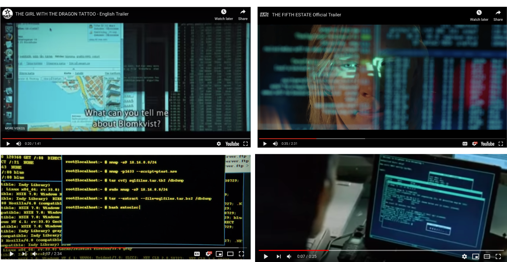
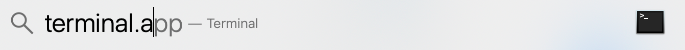
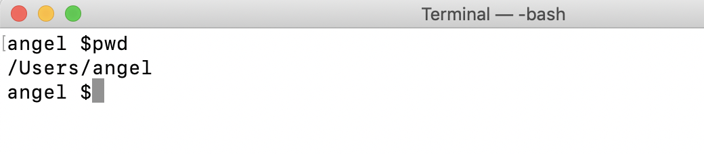
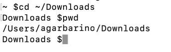

# Day 23 - What is a terminal, and why should I care?

The terminal is a program that you use to type in commands. It is a text input/output environment.  Not knowing how to use a terminal as a Web Developer would be like a writer not knowing how to use a computer; sure they could use a typewriter or good-old pen and paper, but how effective would they be?

In this article, we'll cover what a terminal is, introduce you to a couple of useful commands, and talk briefly about what commands are.

## Opening the terminal

The default terminal is usually white, but you've probably seen black terminals in movies. Featuring a geeky hoodied-hacker doing something like "running an algorithm" or "extinguishing the override" or some other nerd'ish lingo nonsense. Take, for example, the terminal making an appearance in these well-known movies:

From left to right, these images are from _Girl With The Dragon Tattoo_, _The Fifth Estate_, _Snowden_, and _The Matrix_.



Let's start things off by opening your terminal; every major computer comes packaged with a terminal program.

#### Exercise: Opening the terminal

1\. **Mac Users**
There are several ways to open the Terminal on a Mac. I will use Spotlight. To use Spotlight, press cmd + spacebar. Then type in "terminal". You should see the terminal app come up. Click on it.



I>When talking about the actual Terminal program that comes packaged with macOS I'll capitalize the "T."  Otherwise, terminal with a lowercase "t" will refer to any terminal program that interfaces with your Shell - more on that shortly.

1\. **Windows Users**
The dominant Shell-CLI environment for Windows 10 users is PowerShell[^powershell]. To navigate to PowerShell, search for the "PowerShell" in the Windows Explorer and open it up.

Before we start typing commands into the terminal, let's chat briefly about what commands are.

### Commands

As we'll learn more about in tomorrow's article, the terminal works with the Shell of your computer.  If you remember from day 3, Shell wrap around your computers operating system, or more specifically, its Kernal.


The Shell takes commands, processes them, and then does something in response.  For example, when you make a folder on your computer, you are using a program that, like the terminal, commanded your computer's Shell to make a folder.  The Shell communicated with the computer's Kernal to do as you asked.

The terminal is similar, but instead of clicking on menus to make a folder, you *type* those commands.  For example, making a folder can be done using the command inside the terminal:

```bash
mkdir folderName
```

`mkdir` stands for "Make Directory."

I>**Folder and Directory essentially mean the same thing**.  "Directory" is a classical term used when Shells and terminal programs were being developed. "Folder" is a more visual word that came about as Finder and Windows Explorer programs came into existence. Technically, a Directory maps to a file system, whereas Folder is a more nonspecific term. This is why in Shell commands you'll see references to Directory instead of Folder, e.g., *`mkdir` make directory*.

When you run the terminal, you are issuing commands directly to the Shell. You may see a $ when you open the terminal program.  The $ is Shell's symbol for indicating that it's ready to take a command. 

#### Exercise: Shell command practice

1\. Download the [shell-script-practice.sh](src/shell-script-practice.sh) file to your downloads folder on your computer.

2\. If you'd like to peak, go ahead and open this file with your text editor.  The code you see is written in Bash Scripting language; a programming language that works with the Bash Shell.  The Bash Shell is the default Shell that comes with your computer.  We'll learn more about this in tomorrow's article.

3\. Next, open your terminal as we practiced earlier.

4\. From your terminal, we are going to issue our first command called `pwd,` short for "Print Working Directory."  This command tells us in our computer where we are.  The concepts of "where" will be more thoroughly addressed when we talk about File Paths in Day 25 and 26. 

In your terminal type the following:
```bash
pwd
```

The terminal should return something like the following. 



The "Print Working Directory" command returned *where* I am on my computer's file system.  In this example, I'm located on the Users "agarbarino" directory.  If I were on my Desktop it would return something like `/Users/agarbarino/desktop`.   

5\. Next, we're going to tell the terminal to move us into our computer's Downloads folder.  To do this, we are going to use a command `cd`, short for "Change Directories."

Type the following command in your terminal:
```
cd ~/Downloads
```

You can see the "Change Directories" command used in the following screenshot. I also followed that command with another `pwd` to confirm, that yes, I am now in the Downloads Folder.



Now that we're in our Downloads folder, we can run the "shell-script-practice.sh" file we downloaded step #1.

To do this, run the following command:
```
bash shell-script-practice.sh
```

The script will then ask you a couple of questions, go ahead and answer them.


Let's recap what we just did.  
* We used the terminal to navigate to our computer's downloads folder.
* We then told the terminal to use the Bash Shell to open the file "shell-script-practice.sh".  If you peaked at the code on this file, you would have seen Bash Scripting language that walks you through those questions.

Nice work 👏.  You just got your first taste of using the terminal, and running a Shell script.  If this all seems like a lot, that's OK.  It is.  This article is just an introduction.  Learning about Shell Scripting, and most importantly how to use the terminal will be crucial as you learn more about Web Development.

Tomorrow we'll look closer at the differences between the terminal program and programs like the Finder program (Macs) and Windows Explorer (Windows).  Hint, one is called a CLI (pronounced "C L I") the other a GUI (pronounced "Gooey").