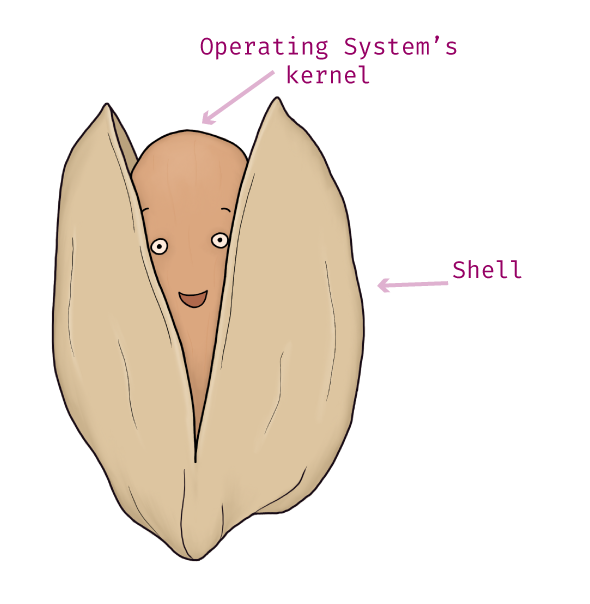
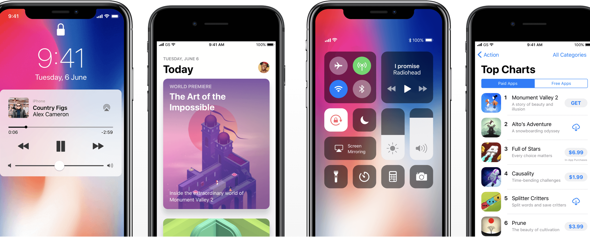
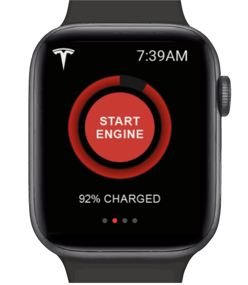
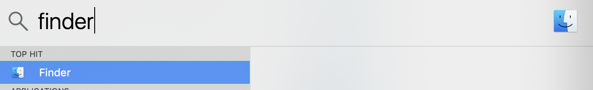
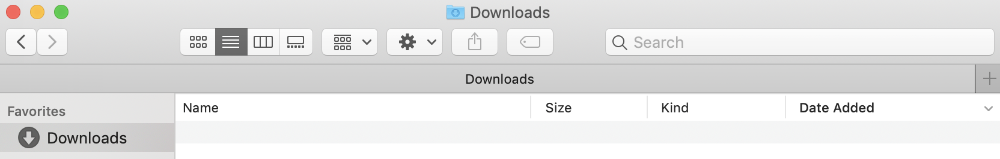
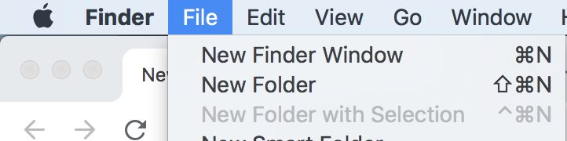
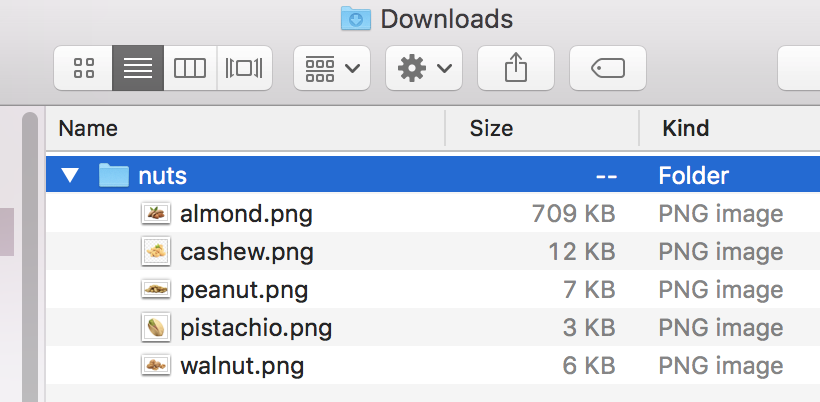

# Day 24 - CLI vs. GUI?

We chatted briefly about Shells in Day 3 and 4 when we talked about Operating Systems.  Here's a quick reminder of that discussion: a Shell is an interface that gives you access to your computer's Operating System. Think of the Shell as a wrapper around your Operating System - technically it wraps around your Operating System's kernel. Hence the name _Shell_ - a shell/protective barrier - around the brain/core of your computer.

Shells come in two forms:

1. **Command Line Interface**: CLI for short, pronounced C. L. I.

2. **General User Interface**: GUI for short, pronounced "gooey."

### CLI

An example of a CLI is the Bash Shell or PowerShell that comes default with macOS and Windows OS, respectively (this is the Shell we played with via the terminal in yesterday's article).

### GUI

GUIs are programs designed to make it easy for the everyday computer user to _do_ things with their computer. They use graphics, icons, and menus to make navigation and executing commands accessible.

GUIs are on smartphones, smartwatches, anything computer-based you'll find GUIs.  Here is an example of a GUI on the iPhones iOS. The GUI provides the icons, and menus you use to navigate or _do_ things on your iPhone.

Here's one more example of a GUI on a smartwatch that starts your Tesla - wouldn't that be nice!

Before GUIs, computer users only had a keyboard and computer screen as tools. To do anything on the computer the user had to type out commands via a CLI. This process is not intuitive for today's average computer user. That's where GUIs come in; GUIs make navigation and actions easier to figure out.

In the following Exercise, we are going to spend time with the Finder program (the equivalent program in Windows is “File Explorer”), doing simple, everyday navigation.  The Finder / File Explorer programs are of course GUIs.

#### Exercise: Playing with a GUI

1\. **macOS Users**: Open the Finder program on your mac (cmd + spacebar, type "Finder")

1\. **Windows Users**: This process is the same, but your GUI will look a little different.  Instead of using the Finder program, you'll be using your [File Explorer](https://support.microsoft.com/en-us/help/4026617/windows-10-windows-explorer-has-a-new-name) program.

2\. Once open, navigate to your Downloads folder.

3\. In your Downloads folder, go to the Finder menu at the top of your computer screen and click File -> New Folder.

4\. Name the folder whatever you would like and move some files into it.

Ta-da you just used a GUI 🥳.

GUIs are everywhere. If you find yourself navigating, clicking, or selecting graphical elements to _do_ something to a device, then it's a safe bet that you are using a GUI.

### CLI

Unlike a GUI, a CLI only takes **typed commands**. It (generally) does not accept mouse inputs, nor does it have icons and buttons to help you _do_ things. Instead, you command it to do things via your keyboard.

We've established that a Shell is a wrapper around a computer's Operating System and that a GUI is a type of Shell. **The other kind of Shell is a CLI** - for our purposes, we will refer to this type of Shell as a Shell-CLI.

I> When computer folks are talking about Shells, it's likely they are referring to a Shell-CLI. However, because we know a Shell can be both a GUI or CLI, we will differentiate them here as either Shell-GUI or Shell-CLI.

The standard Shell-CLI shipped with macOS is **Bash**. Bash has been the standard Shell-CLI shipped with the majority of computers since the early 1990s[^bashstandard]. The standard Shell-CLI for Windows 10 users is **PowerShell**.

I>**Windows Users**: PowerShell is not just a Shell; it is also the application that allows the user to interact with the Shell. Compare this to macOS, which has both the default Shell-CLI called Bash, as well as the Terminal application (with a capital "T") that allows the user to interact with Bash. PowerShell is a complete environment, acting as both the Shell-CLI and the terminal application.  Whereas, the macOS Terminal application is just an application that works with the Bash Shell[^other].

### Where does the terminal fit it?

Bash and PowerShell are Shell-CLIs; they take in typed commands and interact with your computer's Operating System.

T>Remember, the macOS Terminal program, the one with a capital "T," is _not_ a Shell. It's an application that lets you interact with Bash, and Bash _is_ the Shell-CLI.

I know this all might seem a little pedantic, but the reality is a lot of people don't understand the difference between CLI and GUI. However, having even this general understanding of their differences will help you learn more advanced programming concepts as you progress in Web Development. 

Tomorrow, we'll look closer at File Paths; a topic near and dear to my heart. Why?  Because it's a simple yet crucial concept, but folks like to assume you'll intuitively understand the syntax. Thus, very rarely do people stop to discuss how exactly you compose File Paths.  I suspect a good proportion of Web Developers don't understand File Path syntax.  Instead, they fake it until they get stuck, and then resort to guessing.

[^other]: It works with other Shell-CLIs as well, such zsh.  However, to keep the conversation on course, I chose not to talk about the different types of Shells you can download and use on either macOS or Windows OS.