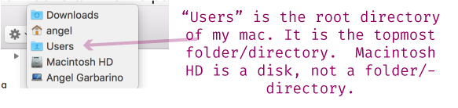
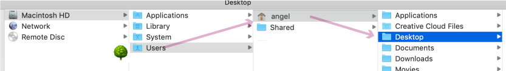
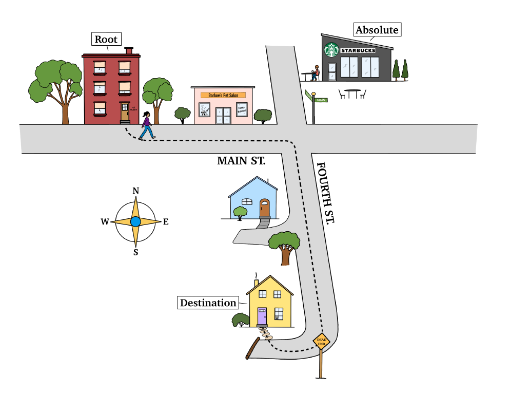

# Day 26 - File Paths Part II

Now that we have a better understand of what file paths are, and specifically what **Relative File Paths** are, today we'll finish up our conversation by looking at the second type of file path: Absolute File Paths.

#### Absolute File Paths

Absolute file paths, use the **root directory** to figure out navigation. The root directory 🌳 ( "root" to elicit the image of a tree's beginnings) is the topmost folder of your file system.

The absolute file path starts at the root directory.

>I **Windows Users**: The root concept is the same for Windows users. The only difference is that instead of "Macintosh HD" the drive is "C:/Windows". If you tab as you enter in the file path, PowerShell will automatically correct any potential errors in your file path. I recommend using this auto-complete feature.

To indicate you are using the absolute file path, you start the file path off with a forward slash **`/`**. **No dot**. The following is the absolute file path to our Desktop.

Here is what that file path looks likes on the Finder.

#### Exercise 7 of 10: Terminal and Absolute File Path

1\. In your Terminal, navigate to your root directory. A quick way to do this is to use the tilde.

I>The tilde `~` indicates the **home directory**. The tilde key can be found in the upper-left side of your keyboard.  The home directory is the home of the user who's executing a command. For me, this translates to `users/angel` for you it will be something like `users/yourComputersUserName`.

2\. Using an absolute file path, let's move into our "nuts" folder.

Remember, using the absolute file path means we start from the root directory, and omitting a dot start with the first Folder we want to move into.  

And just like that, we moved into our nuts folder using an absolute file path.

3\. Now using an absolute file path, let's navigate to our Downloads folder.

If we had used a relative file path the command would have been much shorter. Relative to where we were - in the "nuts" folder" - the Downloads folder is only a folder up. And if you remember, to move a folder up using a relative file path requires us to use two dots. Here is what it would have looked like if we had used a relative file path.

### Summary with Directions Analogy

Let's use a directions analogy to help clarify. Imagine for a moment you are giving a friend directions to your house. Say your friend is at their home. Your directions will start from their house (let's call this the "beginning") and go to your home. The directions might sound something like:

> "Out of your apartment, head East on Main street until you reach 4th street. Take a right on to 4th street. I'm the last house on the right."

Let's call that an absolute path - your directions are starting from the beginning - or at least how I've defined beginning here.

But later, another friend is already at Starbucks on Main street and needs directions. You might say to them:

> "take a left out of the Starbucks onto 4th street. I'm the last house on the right."

Your first friend is starting from the "beginning," and thus you are giving them directions akin to an absolute file path. Your Starbucks friend is starting somewhere else, and you give them directions relative to where they're at, much like a relative file path.

Either these past two articles have helped clarified what was before a bit of a mystery, or prevented you from future befuddlement.

Tomorrow we'll learn more about File Systems and File Types.  The information isn't profound, but it helps connect all the dots together.