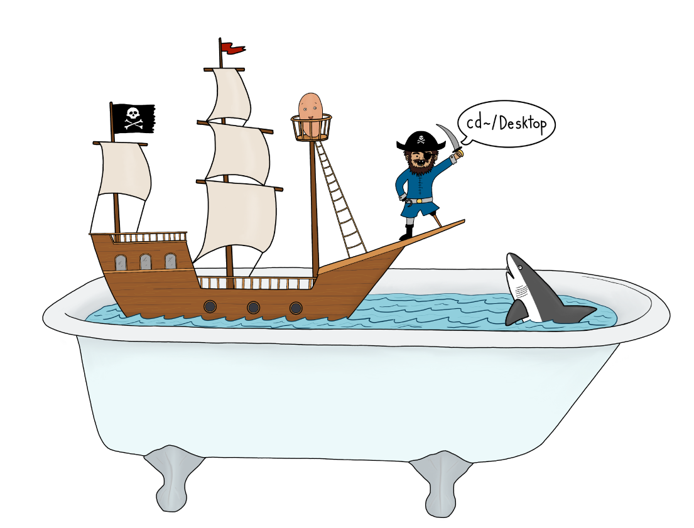
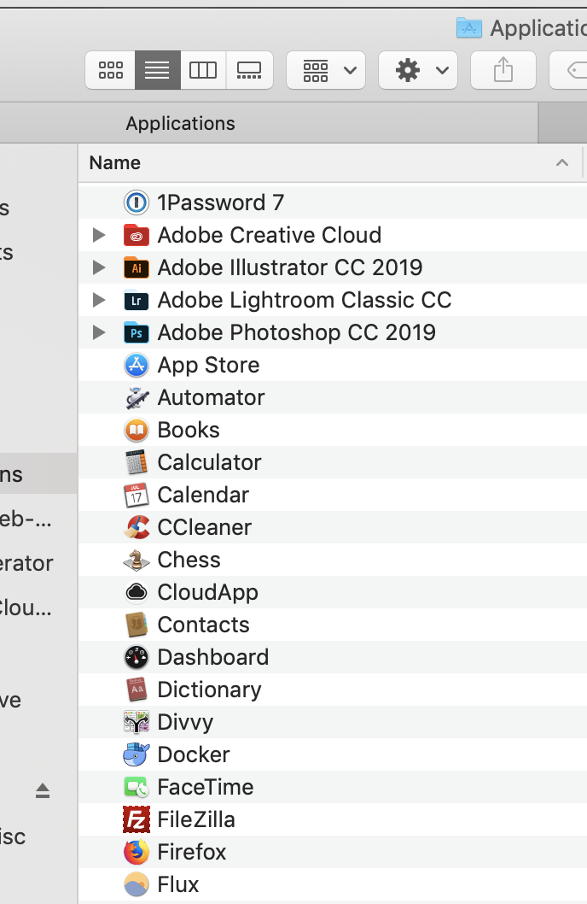
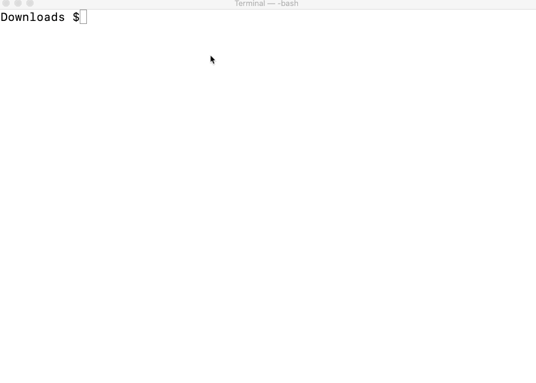

# File Systems and Types

### File System

We now have a better understanding of how to navigate around our computer, but what exactly are you navigating _in_? If you were the captain of a ship, I basically just showed you how to sail a ship, but did not tell you if you'd be in the Atlantic, Bering Strait, or a bathtub.



Your computer uses a File System to organize everything on it, and it is this File System that you're navigating around when inside the terminal. Whenever you are moving files, creating folders, or deleting things you are doing those things on the computer's File System.

The File System is your terminals equivalent of the captain's bathtub.

#### File Types

The File System is made up of two types of files:

1\. **Data files**. Think anything that contains data, text files, word docs, images, mp3, etc.

For example, the ["shell-script-practice.sh](src/shell-script-practice.sh) file that we played with on Day 23 is a data file.  Another example is the ["html-practice.html"](src/html-practice.html) file we played with on Day 8 while learning about HTML. One's an HTML file, the other a Shell Scripting file, but they are both data files.

2\. **Executable files**. These are files that when you open them, they execute something. It's a good bet that any file in your Applications folder is an executable file.



All of these files run a program on your computer. When you open _Adobe Illustrator_ or the _Calculator_ application, you are running executable files[^appexe].

Another, less obvious, example of an executable file are the commands we've been running in the terminal. Think about it; every time we executed a command in the terminal, the commands _do_ something. Behind the scenes, these commands are linked to executable files.

### Pop-Quiz! 🤨

Let's see how well you know your File Types.  We'll be using the terminal and a Shell Script file to take our "quiz." Because practice 🤓.

1\. Download the following [Shell Script file](src/quiz.sh), and then, as we did in Day 23, navigate to your Downloads folder, and open the file using the `bash` command.

```bash quiz.sh```



Go through the quiz, and do your best.  I by no means have any way of  knowing how you did, but if it makes you feel better, you got an A ⭐️.  Nice work 👏!

### What's next?

Tomorrow, I'll be introducing you to one of your soon-to-be favorite tools: **Git**

Simply put, Git helps you keep track of file changes. If that doesn't sound like a tool that will be a "soon-to-be favorite" give me by the end of tomorrow's article to convince you otherwise. 

[^appexe]: https://medium.com/@jalendport/what-exactly-is-your-shell-path-2f076f02deb4