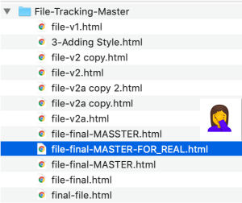
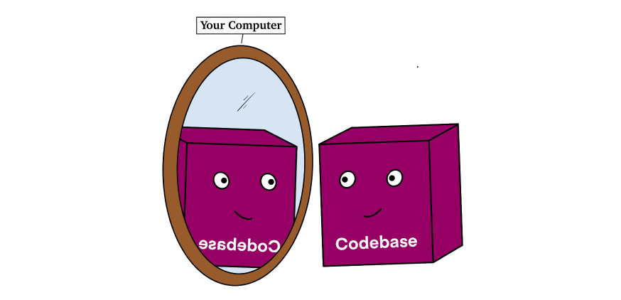
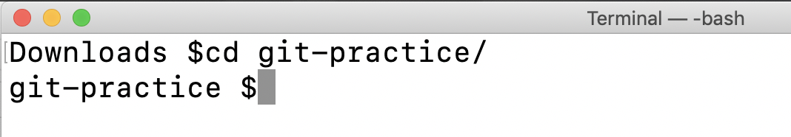
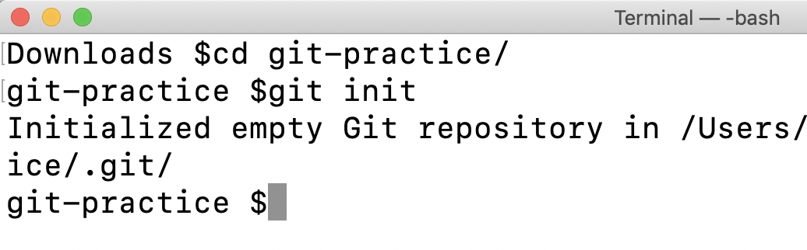
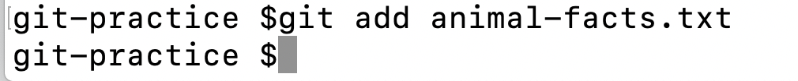
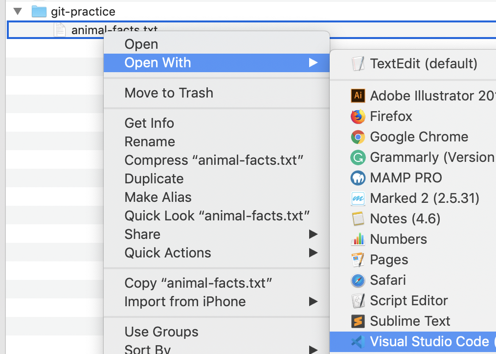
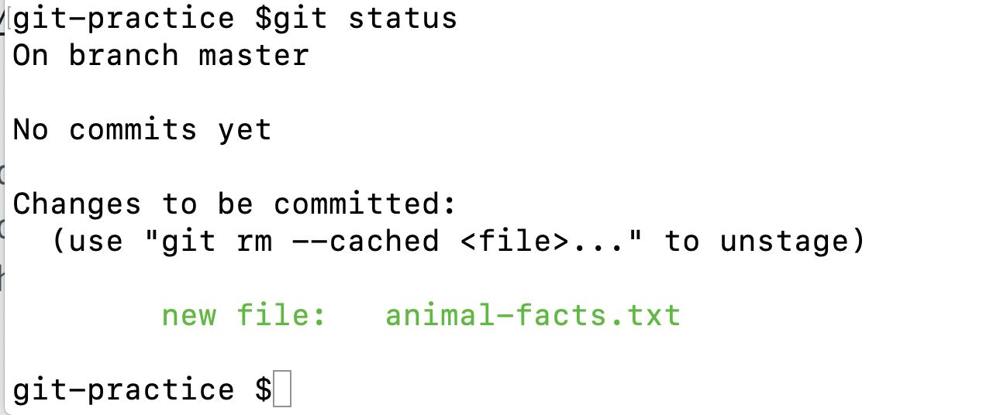
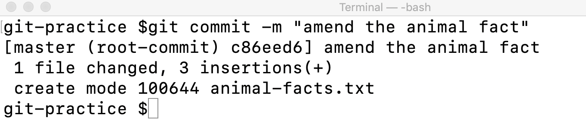
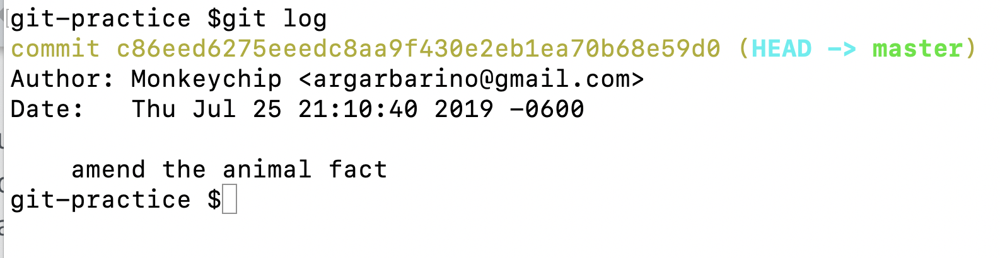

# Introduction to Git for Web Developers

>Have you ever run into file saving hell 🔥? Git to the rescue 🚨.

You started with good intentions, telling yourself you'd stick with an organized system of v1, v2, etc., but a couple spelling mistakes, and recovered files later you've got a file system like the following:

You're not alone.  This problem is universal: developers, grandmas, your mail-person, anyone who has touched a computer.  Thankfully, software platforms of all sorts have come together to create a variety of solutions.

Web Developers are especially demanding when it comes to version control.  They are continually making small tweaks, revising, sharing code, and looking at changes done to code in the past.  Today, Git is the technology that developers use to solve for their onerous version control needs.

Git is [open-source](https://en.wikipedia.org/wiki/The_Open_Source_Definition), meaning that it is free to use and may be redistributed or modified.  Released in 2005, Git become popular very quickly and had wide-sweeping impacts on the programming community.  There were Version Control Systems before Git came along, but Git's unique approach to tracking changes was an industry game-changer.

There has been and still is no real competitor to Git.  As a future Web Developer, you will need to know how to use it.

In this article, I will briefly look at the history of version control systems, highlighting what makes Git special.  This will be followed by a "speed-dating" type introduction to a simple Git workflow.

I>I go into much more detail on Git and GitHub in the book 📗"How to Become a Web Developer: A Field Guide."

## Version Control

We've all been there.  You saved a file on your computer, but accidentally removed something you wanted to keep.  Maybe you thought ahead and have a previous version of the file you can search through, or more likely you didn't.  Version management sucks and its suckiness grows exponentially larger when you're a developer working on a huge codebase.

Developers have been trying to solve for the version control nightmare since there started being developers.  Working on codebases present several consistent challenges, regardless of the size of the codebase or the number of people working on them.  These are - generally - as follows:

- Version control
- Keeping an accurate history of file changes
- Logging information about file changes
- Allowing different people to make changes to the same codebase at the same time

#### Version Control Systems (VCS)
At first, developers tried to solve some of these problems with simple Version Control Systems (VCS).  These were OK, but they only helped developers keep track of files that had changed.  They didn't solve for any of the other issues mentioned above.

Additionally, these VCS were local.  Meaning the _whole_ codebase was on the developers' machines.

Local VCS also didn't come close to solving the issue of different developers collaborating on the same codebase.  If the code was on your computer, how could you easily share it with another developer?

> Meet Bob.  He's a programmer in the 1980s.  

>Co-worker: "Hey, Bob, can you email that file version again? I think it's from the change you made on Friday, but I can't be certain.  I know you already sent it, but I'm too lazy to look.  Thanks!"

>Bob: "I quit."

>I would too, Bob.

#### Centralized  Version Control Systems (CVCS)
Next came [Centralized Version Control Systems](https://en.wikipedia.org/wiki/Perforce) (CVCS). CVCS improved upon the process enough that they were the industry standard through the 90s up until Git was released. 

Unlike VCS, CVCS stored the codebase in a single place, not on individual computers.  Whoever needed to work on something would check out that file to work on it; similar to checking out a book from a library.  The problem, what happens if the place with your codebase burns down, or the library floods?  

> Meet Kat. She's a programmer from 2003.  

> Co-worker: "Hey, Kat, did you hear there was a massive hail storm in Aurora, Nebraska. They recorded 7-inch diameter [hail](https://en.wikipedia.org/wiki/List_of_costly_or_deadly_hailstorms#North_America)!  Isn't that where we have the computer that holds all of our code?"

>Kat: "I quit."

>I would too, Kat.

#### Distributed Version Control System (DVCS)
The third times a charm.  Building off of VCS and CVCS, developers created [Distributed Version Control Systems](https://en.wikipedia.org/wiki/Distributed_version_control) (DVCS).  **Git is a DVCS**.   

In DVCS, programmers check out a fully mirrored version of the codebase.  If this were a library, instead of checking out a book, you'd be checking out a mirrored image of the library, the book included.  Thus, if the library burned to the ground, anyone who checked out a mirrored version of the library could restore it with their version.  

DVCS also allow for branching and merging.  Branching here means to duplicate.  With Git, this often means you are duplicating the codebase you are looking at.  You make a branch - a duplicate of the codebase - then you make changes on that branch.  Merging comes in when you want to _merge_ the changes on your branch back to the original codebase.

>Meet Ivan. Ivan is a programmer from 2006.

>Co-worker: "Hey, Ivan, we made a change a year ago, and I think we need to merge that change back into the codebase.  Can you help me?"

>Ivan: "We can do it, no problem.  Go learn some Git, and you can do it sans my help."

>Ivan's a bit of a jerk for not helping, but at least he's not quitting. 

## Git

There are two main ways to use Git.  Through your terminal, or a [Git GUI](https://git-scm.com/downloads/guis/). I will encourage you to use the terminal.

Before I have you download Git, I am going to jump ahead a step and have you set up a **GitHub** account.  After you set up your GitHub account, I'll _then_ have you install Git.

I>We will cover GitHub in tomorrow's article.  I am having you set up an account now so that you can enter your GitHub credentials during the installation process of Git.

#### Exercise: Setup a GitHub account and install Git

1\. Open the [GitHub website](https://github.com/) and sign up for an account.

When you set up your GitHub account, take note of your GitHub username and email.  You will use these in the next step when installing Git.

2\. Next, let's **install Git**.

Git itself has a wonderful installation guide, which you can [find here.](https://git-scm.com/book/en/v2/Getting-Started-Installing-Git)

**Windows Users**: You will be downloading Git for Windows.  Click [here](https://gitforwindows.org/) to begin the download process.

I> ⚠️ PAY ATTENTION: During the installation process, Git will ask you for your GitHub username and email. By giving Git your GitHub username and email, you're connecting your local Git with your GitHub account.

3\. Next, download the folder ["git-practice"](src/git-practice) into your Downloads folder.  

From your terminal, navigate to your Downloads folder, and `cd` into this folder.

4\. Next, we are going to "initialize" a Git repository, e.g., a project that is now being watched by Git.  To do this, enter the command `git init`.

5\. Git has initialized this folder, meaning that Git now knows you want to have it manage version control for _this_ folder and everything inside it. But Git does not know what files and changes you want to save.  We'll change that with the `git add` and `git commit` commands.

To keep with the "speed-dating" theme, I won't go into details about adding, staging, and committing in this article.  Instead, know that Git is watching 👀 the "git-practice" folder, but **to save a change to Git, we need to add the file to staging, and then commit it**.

The file we want to add to staging is the  "animal-facts.txt" file that is in the "git-practice" folder.

To add this file, we will use the following command: `git add animal-facts.txt"`.  In Git, this is called "staging" a file.  Go ahead and run this command.

6\. Next, open the file "animal-facts.txt" in your text editor.

We are going to amend this file.  The animal fact that is in there is not the full story.  Go ahead and modify as I have or make any other modification you want.  Remember to save your changes.

7\. Back in your terminal, type `git status`.

Git returns a message that says that a file we staged has changed.  Git is now asking if we want to "commit" this change.  Commit here means to record the change.  We are going to commit this change with a message. 

We do this using the `git commit -m "some message typed here"` command.  Go ahead and type this command, and modify with whatever message you'd like.

Git has now saved our file change.  And more than saving the change, it's made a record of our change that includes the author (my GitHub username is Monkeychip), a timestamp, and the message.

To see this log, type: `git log`.

Nice work, you made it through your first Git workflow 🍻.  The purpose of this exercise was to get you set up with Git and introduce you into the ways Git records changes.

### What's next? 

There is a heck-of-a-lot that I did not cover here.  And it pains me a little to leave you here, in this unfinished state, but I'll sleep at night if you remember this is *just an introduction*.  

As a future Web Developer, Git will become apart of your day-to-day workflow.  The more familiar you are with Git, the more powerful and efficient developer you'll be. 

Tomorrow, I'll introduce GitHub and explain the Git + GitHub relationship.
